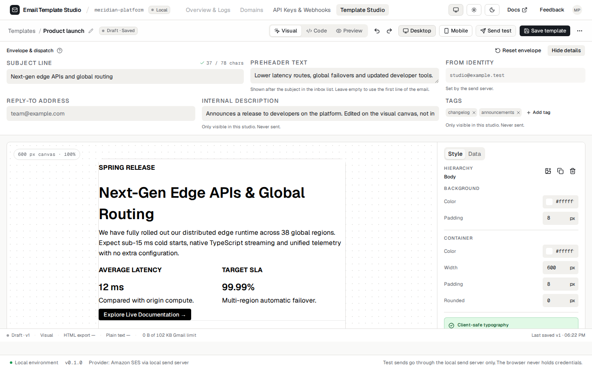
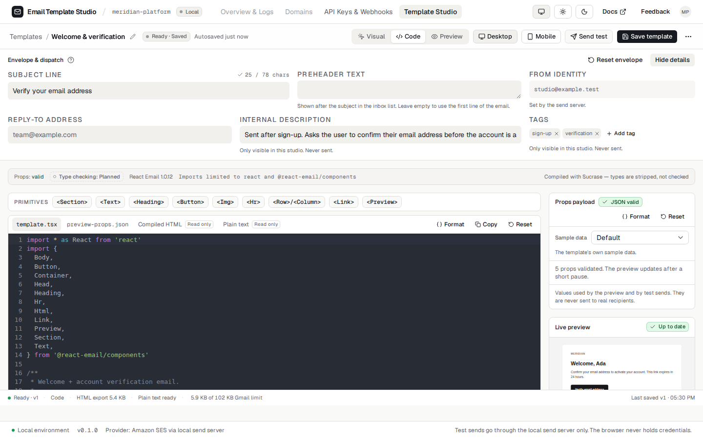
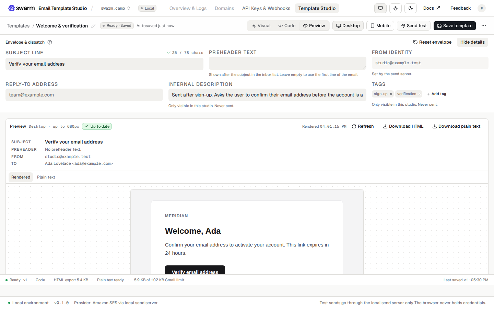

# Email Template Studio (MVP)

An internal studio for authoring transactional email. Templates come in two kinds — a **visual** one you build on a canvas and a **code** one you write as [React Email](https://react.email) TSX — and both are previewed in an isolated frame, saved as immutable versions in Cloudflare D1, and can be sent as a test through Amazon SES.

The studio has three modes. The screenshots below are taken by `e2e/screenshots.spec.ts` from the production build, so they cannot drift from the app:

**Visual** — a 600 px canvas, an inspector rail and merge-field chips:



**Code** — React Email TSX in CodeMirror, with the props payload, render report and diagnostics in the right rail:



**Preview** — the rendered email in a sandboxed iframe, at desktop or mobile width, with its plain-text part beside it:



**Status** (deployment facts last verified 2026-09-15; see `docs/PRIORITIES.md` §1 and §3, which is where the corrections to them are tracked): MVP plus test sending in both runtimes, deployed to Cloudflare at https://email-template-studio.swarm-work-emailer.workers.dev. Live sending is on there for this test deployment, behind the shared-password gate, with the AWS keys as Worker secrets (a deliberate exception while it is a test sender); see "Turning live sending on" in `docs/DEPLOYMENT.md` and, for the move to the company accounts, `docs/HANDOVER.md`. The browser never holds credentials: test emails go through the API in `server/`, which talks to Amazon SES only when you enable it, and only to the recipients `SES_ALLOWED_RECIPIENTS` permits (a list, or any typed address when it is `*`). The same sender runs in the local Node server and in the Cloudflare Worker. See `docs/SENDING.md`.

## What you can do

**The library**

- Browse every template in the database, search it by name, slug or category, and see which kind each one is.
- Create a template (visual or code, blank or copied from an existing one) and delete one by typing its slug.
- Four starters ship with the schema: welcome/verification, password reset and team invitation as code, and `Product launch` as a visual template.

**Editing a visual template**

- Build the email on a 600 px canvas: text, headings, buttons, images, sections, columns, dividers and lists, from a `/` menu or the bubble menu.
- Change type, colour, spacing, padding and size in an inspector rail that says which client-safe fonts it falls back to.
- Upload an image; it is stored in Cloudflare R2 and served from `/media/:key`, never as a `data:` URL.
- Insert `{{merge fields}}` as atomic chips; they export as literal `{{key}}` and are filled in from the props payload for the preview and for test sends.
- Convert the template to a code template, one way, after the generated TSX has been rendered once to prove it works.

**Editing a code template**

- Write React Email TSX and the JSON preview payload in CodeMirror, with formatting, reset and a primitives strip that inserts components at the cursor.
- Read the compiled HTML and the plain-text part in their own tabs.
- See JSON syntax errors and schema errors (with field paths) reported separately, and swap the payload for one of the sample data sets derived from the template's own sample and schema (`Default`, `Long values`, `Missing optional fields` — only the ones that are both valid and actually different).
- Read a render report (render time, sizes, a sparkline of the last twelve renders) and a diagnostics panel that only claims what it actually checks.

**Both kinds**

- Edit the envelope: subject (counted against the 78-character recommendation), preheader, reply-to, internal description and tags.
- Preview the rendered email in a sandboxed frame at desktop or mobile width, with its plain-text part beside it, and download either.
- Switch the app between light and dark; the email itself always stays light, because that is how it will arrive.
- Save a new version; every save is an immutable row, and saving against a stale revision explains the conflict instead of overwriting it.
- Read the version history of a template — number, kind, who saved it, when and the note — read-only.
- Keep unsaved edits per template for the browser session (they survive a refresh, not closing the tab) and reset them back to the saved version.
- Send a test email of the current preview to up to 10 addresses through Amazon SES, with the merge-resolved subject, an HTML and a plain-text part and a reply-to — or see exactly why sending is unavailable.

## Quick start

Requirements: Node.js 22 or newer (developed on Node 26.8) and npm (no pnpm/bun/yarn needed).

```bash
npm install
npm run db:migrate # REQUIRED, and BEFORE `npm run dev`: creates the local template
                   # database under .wrangler/state/v3 and seeds the four starters.
                   # Without it the library screen says template storage is unavailable.
npm run dev        # http://localhost:5173, API in the Cloudflare runtime (workerd)

# no database to hand? run with an in-memory store instead (nothing is saved)
VITE_DATA_MODE=memory npm run dev

# optional, for real test sends through Amazon SES (see docs/SENDING.md)
cp .env.example .env   # then edit
npm run server         # terminal 1: Node send server
npm run dev:node       # terminal 2: the studio, proxying /api to it
```

`npm run dev` reads the top-level `vars` in `wrangler.jsonc`, which today say sending is enabled and
not a dry run. With no AWS credentials in `.dev.vars` the Worker logs `sending is disabled` and the
send dialog says so, while templates, uploads and previews keep working; **with** credentials there,
`npm run dev` is a live sender. `STUDIO_SEND_DRY_RUN=true` in `.dev.vars` is the setting for day-to-day
work (`docs/SENDING.md`, and `docs/PRIORITIES.md` §3.5–3.6 for why this is the way it is).

Deploy: `npm run deploy` (needs `npx wrangler login`, and `npm run db:migrate:prod` first; see
`docs/DEPLOYMENT.md`).

## Scripts

| Command                   | What it does                                                                                                         |
| ------------------------- | -------------------------------------------------------------------------------------------------------------------- |
| `npm run dev`             | Start the Vite dev server with hot reload; `/api` runs in workerd via the Cloudflare plugin.                         |
| `npm run dev:node`        | Same, but `/api` is proxied to the Node send server (`npm run server`).                                              |
| `npm run build`           | Generate Worker types, type-check (`tsc -b`) and build the client and the Worker into `dist/`.                       |
| `npm run preview`         | Serve the production build locally (workerd for `/api`). `preview:node` proxies to the Node server.                  |
| `npm run server`          | Start the Node send server (the only runtime that has talked to real SES). `server:dry-run` logs instead of sending. |
| `npm run deploy`          | Build and deploy the Worker with wrangler.                                                                           |
| `npm test`                | Run unit and component tests once (Vitest).                                                                          |
| `npm run test:watch`      | Run tests in watch mode.                                                                                             |
| `npm run test:e2e`        | Run Playwright browser tests against the production build (needs `npx playwright install chromium` once).            |
| `npm run typecheck`       | Type-check without emitting files.                                                                                   |
| `npm run lint`            | Lint with oxlint (the linter the Vite template ships with).                                                          |
| `npm run format`          | Format with Prettier. `format:check` only reports, which is what CI and `npm run check` run.                         |
| `npm run cf:types`        | Regenerate `worker-configuration.d.ts` from `wrangler.jsonc` (run after changing bindings or vars).                  |
| `npm run check`           | Typecheck, lint, format check and unit tests in one go (the same gate CI runs).                                      |
| `npm run db:migrate`      | Apply the SQL migrations to the **local** template database (`.wrangler/state/v3`).                                  |
| `npm run db:migrate:e2e`  | The same, for the separate database the Playwright suite uses (`--env e2e`).                                         |
| `npm run db:migrate:prod` | Apply them to the real Cloudflare D1 database. Always before `npm run deploy`.                                       |
| `npm run db:console`      | Run one SQL statement against the local database: `npm run db:console -- "SELECT * FROM templates"`.                 |
| `npm run seed:generate`   | Regenerate the starter-template seed migration after editing a starter.                                              |

## How it is put together

```
src/
  domain/          Plain types: TemplateRecord (code | visual), EmailDocument, TemplateEnvelope,
                   PreviewPayload, ValidationResult, RenderResult, StudioMode, DiagnosticItem
  application/     Use cases, all pure: studio state reducer, payload parsing, merge fields, props
                   presets, diagnostics, template filtering, visual -> TSX conversion, the
                   TemplateRepository port
  infrastructure/  The outside world: HTTP and in-memory template repositories, the render worker
                   pipeline, the visual editor's renderer and merge-field node, the starters and the
                   seed input for migration 0002, browser session storage, the email provider
  presentation/    React: the shell, the library screen, the studio (chrome, envelope, visual, code,
                   preview, dialogs), hooks and shared components
  components/ui    shadcn/ui components (generated, editable)
  components/motion beUI animated badge (vendored, editable; on CSS keyframes since ADR-4's update)
shared/            Zod contracts for the template API, shared by the browser and the server
server/            Runtime-neutral Hono API (config, auth, sender contract, template and upload
                   routes, the D1 and in-memory stores), Node adapter, SES sender
worker/            Cloudflare Worker entry: hosts the same API and binds D1 and R2; wrangler.jsonc
                   describes the deployment
migrations/        Numbered SQL applied with `wrangler d1 migrations apply` (schema + starter seeds)
e2e/               Playwright browser tests, including the one that takes the screenshots above
docs/              Assessment, architecture, decisions, technical debt, roadmap, priorities, learning
                   guide, design, sending, deployment, handover
```

The dependency direction is one way: `presentation -> application -> domain`, and `infrastructure` implements what `application`/`domain` need. See `docs/ARCHITECTURE.md`.

## How rendering works, in two paragraphs

**A code template.** Your TSX is compiled in the browser by [sucrase](https://github.com/alangpierce/sucrase) inside a Web Worker, evaluated with a `require` that only knows `react`, `react/jsx-runtime` and `@react-email/components`, rendered by React Email to HTML **and** to a plain-text part in the same pass, and shown in an `<iframe sandbox="">` whose document carries a Content-Security-Policy that forbids scripts. A 5 second timeout terminates the worker if a template loops forever. This is a documented isolation strategy for an internal tool, not a hard security boundary; the details and residual risks are in `docs/ARCHITECTURE.md`.

**A visual template.** The canvas is `@react-email/editor` (Tiptap), loaded only when a visual template is opened — a code template never fetches it, and a test asserts that. Its document exports through the same React Email components, so both kinds end up as one `{ html, text }` result. `{{merge fields}}` survive the export as literal tokens and are filled in afterwards, as a string pass, which is why a saved version stays unresolved and a future server-side send can substitute per recipient (ADR-26).

## Documentation

- `docs/ASSESSMENT.md` — repository assessment, assumptions, risks, prerequisites, plan and validation commands
- `docs/ARCHITECTURE.md` — layers, render pipeline, isolation, state model
- `docs/DECISIONS.md` — architecture decision records, ADR-1 to ADR-30 (framework, editors, compiler, persistence, concurrency, merge fields, conversion, theme…)
- `docs/TECH_DEBT.md` — known shortcuts and how to pay them down
- `docs/ROADMAP.md` — milestones and the backlog of deliberately deferred work
- `docs/PLAN.md` — build plan for the full application and the move to Cloudflare (phases, decisions, risks)
- `docs/PRIORITIES.md` — the ranked backlog: what to do now, next and later, and the decisions still open (2026-09-19). It wins over `ROADMAP.md` on ordering
- `docs/FEATURE_PLAN.md` — phased plan for the dashboard screens and the multi-project hierarchy
- `docs/LEARNING.md` — concepts to learn, mapped to the files that use them
- `docs/DESIGN.md` — visual system, tokens, microcopy and motion rules
- `docs/SENDING.md` — enabling and using test sends through Amazon SES
- `docs/DEPLOYMENT.md` — where the studio runs, how to deploy, and how to switch live sending on
- `docs/HANDOVER.md` — step-by-step move to the company Cloudflare account and GitHub organisation

## Guarantees

- No AWS keys exist in the codebase. They are read from the environment (`.env`, `.dev.vars`) or from Cloudflare Worker secrets, and are needed only for a live, non-dry-run send.
- The browser never talks to SES; it only talks to the `/api` routes in `server/app.ts`.
- Sending is off unless `STUDIO_SEND_ENABLED=true`. When on, `SES_ALLOWED_RECIPIENTS` decides who may receive (a list, or `*` for any typed address), at most 10 addresses go out per send, subjects are prefixed with `[TEST]`, and sends are rate limited. The Node adapter also binds to loopback only.
- Nothing in the studio pretends. There is no simulated publish (it was deleted), the version
  history is read-only because restoring is not built, the diagnostics panel lists only checks it
  actually runs, and every control that cannot be used says why rather than being greyed out.
- The email is never themed by the studio: the canvas sheet, the preview frame and the rail
  thumbnail all stay light when the app is dark, so what you see is what will arrive (ADR-29).
- A saved version is immutable, and a save against a stale revision is refused with the server's own
  copy rather than overwriting somebody else's work.
