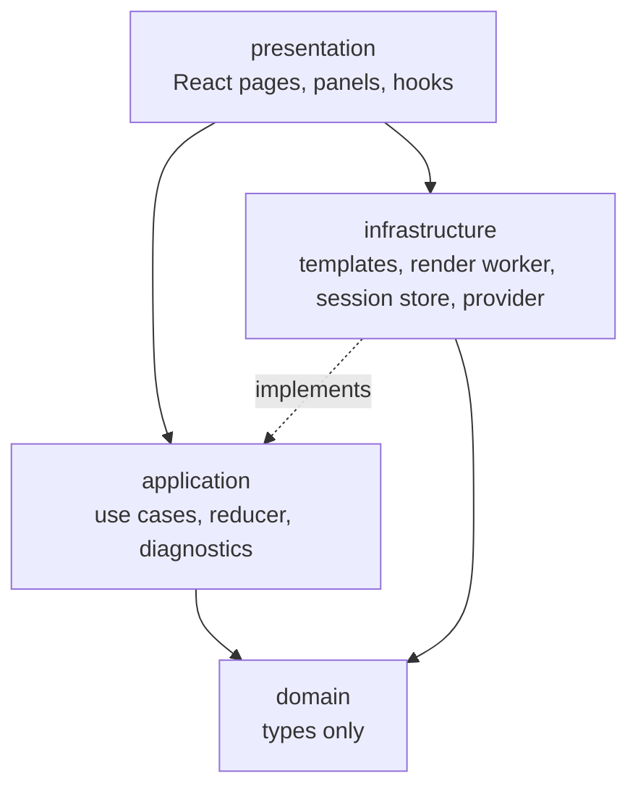
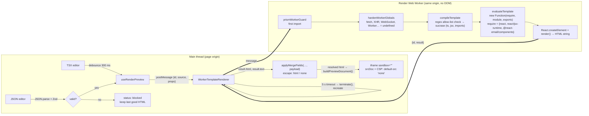
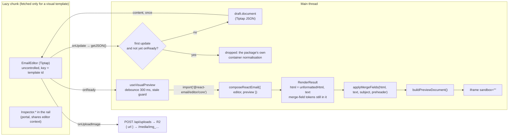
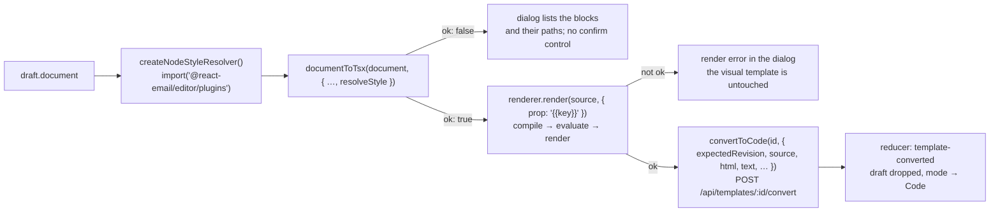
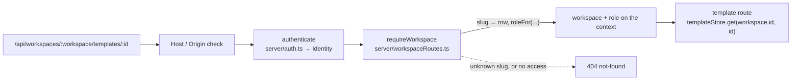
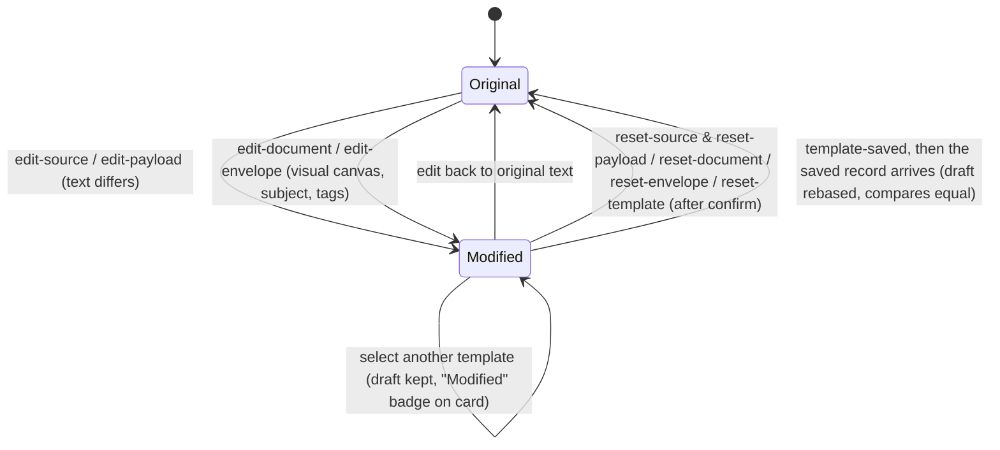
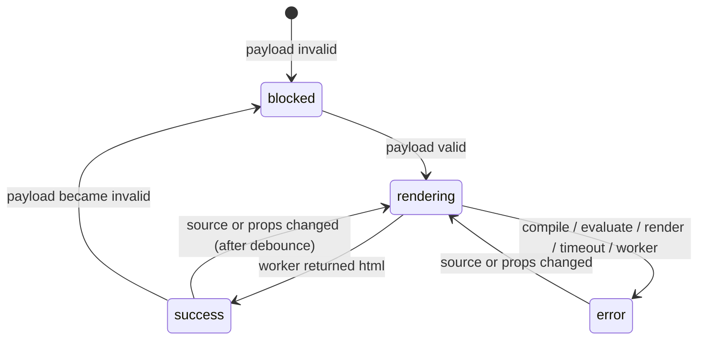
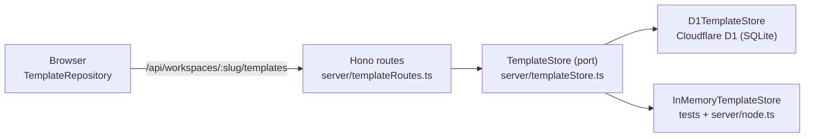
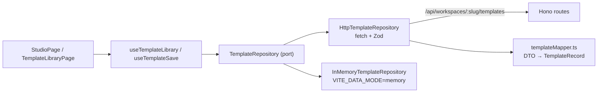

# Architecture

Practical layering, one page, no ceremony. The rule that matters: **dependencies point inwards**. `presentation` may import `application`, `domain` and `infrastructure`; `application` may import `domain` only; `domain` imports nothing; `infrastructure` implements interfaces the inner layers declare (for example `PropsValidator`, `TemplateRenderer`, `TemplateRepository`). `shared/` sits outside the layers: it is the wire contract, imported by the app, the Node server and the Worker alike, and may import only `zod`.

| Layer          | Folder                           | Contains                                                                                                                                                                                                                                                                                                                                                                                                                                                                                                                                                                                                                                                               | Must not contain                                 |
| -------------- | -------------------------------- | ---------------------------------------------------------------------------------------------------------------------------------------------------------------------------------------------------------------------------------------------------------------------------------------------------------------------------------------------------------------------------------------------------------------------------------------------------------------------------------------------------------------------------------------------------------------------------------------------------------------------------------------------------------------------- | ------------------------------------------------ |
| Domain         | `src/domain`                     | `TemplateRecord` (`code` \| `visual`), `EmailTemplate`, `TemplateMetadata`, `TemplateEnvelope`, `EmailDocument`, `PreviewPayload`, `ValidationResult`, `RenderResult`, status unions                                                                                                                                                                                                                                                                                                                                                                                                                                                                                   | React, Zod, Tiptap, browser APIs, network        |
| Application    | `src/application`                | `parsePreviewPayload`, `studioReducer` (select, edit, reset, device, mode), `studioModes`, `buildDiagnostics`, `mergeFields`, `propsPresets`, `visual/` (`documentToTsx`, `tsxPrinter`, `convertedVersion`), `repositories/` (ports: `TemplateRepository` and its result types)                                                                                                                                                                                                                                                                                                                                                                                        | React, DOM, Zod                                  |
| Infrastructure | `src/infrastructure`             | Starter registry + `starterCatalog.json` + Zod schemas, `templateMapper` (record → `EmailTemplate`), props validators, render pipeline and worker, session storage, no-send provider                                                                                                                                                                                                                                                                                                                                                                                                                                                                                   | UI                                               |
| Presentation   | `src/presentation`               | `AppShell` + `GlobalHeader`, `templates/` (route, library page, grid, card, search), `StudioPage`, panels, dialogs, hooks (`useStudio`, `useTemplateLibrary`, `useRenderPreview`, `useVisualPreview`, `useTheme`), `layout/theme.ts` (pure: what a stored theme preference means, next to the pure formatters in `shared/` — `relativeTime`, `formatBytes`, `templateKind`, `templateStatus`, `diagnosticPresentation`)                                                                                                                                                                                                                                                | Business rules (they live in application)        |
| ⤷ visual       | `src/presentation/studio/visual` | `VisualWorkspace` (lazy boundary), `VisualEditorSurface` (mounts `@react-email/editor`; with `mergeFieldNode` and `editorExtensions` one of **three** static importers, all three reachable only through this lazy seam - the other three modules allowed to name the package never pull it in: `visualEmailRenderer` `import()`s `/core`, `visualStyleResolver` `import()`s `/plugins` and is itself in the EAGER graph (`StudioPage` → `useConvertToCode`), so only that dynamic import keeps the split, and `studioTheme` takes a type only), `EmailCanvas`, `CanvasChip`, `StudioInspector`, `FontFallbackNote`, `InspectorFooterShortcuts`, `documentUpdateGuard` | A static import of the editor from anywhere else |
| Shared         | `shared`                         | `templateContracts.ts`: the request/response Zod schemas and size caps the browser, the Node server and the Worker all validate against                                                                                                                                                                                                                                                                                                                                                                                                                                                                                                                                | Everything but `zod`                             |

## The preview pipeline

The one mechanism worth a picture: where user code runs, what it can reach, and how it is stopped.

### Why this design

- **Compile in the browser.** No server exists yet, and running arbitrary TSX on a shared server would be worse than running it in the author's own browser. sucrase is small (about 650 KB ESM), synchronous and worker-safe.
- **Web Worker.** Keeps the UI responsive, and gives the main thread a kill switch: `worker.terminate()` stops infinite loops that no `try/catch` could. The client recreates the worker lazily on the next request.
- **`require` shim.** After sucrase rewrites `import` to `require()`, the only modules that exist are the three in the map. Anything else throws a clear error. A regex pre-check gives a friendlier message earlier, but the shim is the actual boundary.
- **Hardened worker globals.** Workers share the page origin and could `fetch()` with the page's cookies. Before any template code runs, network-capable globals are replaced with `undefined` on the global object and its prototype chain (non-writable, non-configurable). Verified in E2E: `typeof fetch === 'undefined'` inside templates.
- **Sandboxed iframe + CSP.** `sandbox=""` removes scripts, forms, popups and same-origin access. The injected `Content-Security-Policy` meta forbids everything except inline styles, images and fonts. Rendered HTML from React Email contains no scripts anyway (asserted in E2E).
- **The preview document pins its own colour scheme.** `buildPreviewDocument` injects a second meta, `<meta name="color-scheme" content="light">`, because a frame inherits the colour scheme of the page that embeds it. The app is themable and the email is not: without this, turning on dark mode would quietly redraw the preview iframe and the rail thumbnail in dark, which is not what the recipient will see (ADR-29).
- **The worker is warmed up at start-up.** Its bundle is megabytes of compiler and React Email, and fetching and parsing it happens _inside_ the render timeout. Since the studio opens on the library, that cost no longer overlaps with page load, so `App.tsx` calls `renderer.warmUp()` on mount; otherwise the first preview on a cold machine can be killed at 5 s and wrongly reported as an infinite loop. A timeout or a crash starts a replacement straight away, but a crash only does so twice in a row: a worker whose bundle cannot start at all would otherwise refetch megabytes in a loop, so after that the next `render()` creates one lazily.
- **Last good render is kept.** When a new render fails or the payload is invalid, the preview shows the previous HTML with a banner rather than flashing empty.

### What code is allowed

- One file, default-exporting a React component. Named exports are ignored.
- Imports: `react`, `react/jsx-runtime` (implicit via JSX) and `@react-email/components`. Nothing else, including relative files.
- Any TypeScript syntax sucrase understands (types are stripped, **not checked**).
- Props come only from the validated JSON payload.

### Residual risks (read before exposing this to untrusted users)

1. A worker is **not a security boundary**. The hardening can be bypassed by a determined author only through browser bugs, but the worker still shares storage quotas and CPU with the page. Acceptable for teammates; not for anonymous users.
2. **Memory bombs** (e.g. building a multi-GB string) can crash the tab before the 5 s timeout fires.
3. The regex import check can be fooled by comments or template strings; the `require` shim still blocks execution, so this only affects the quality of the error message.
4. Types are not checked in the browser, so a template can compile and then throw at render time; the error is shown but not prevented.
5. The iframe CSP allows `img-src http:`; a template can therefore embed a tracking pixel that fires when previewed. Mail clients behave the same way; tighten to `https:` if preferred.

## The visual pipeline

The second way to author an email, next to the code one above. Same currency (`RenderResult`), same
preview, same send — a different way of producing the HTML.

Things worth knowing about it:

- **The editor is uncontrolled.** `content` is handed over once per template (`key={templateId}`) and
  the draft is never fed back in. Feeding a controlled value back would fight the editor's own
  undo history and reset the caret on every keystroke.
- **`onUpdate` is guarded.** The package normalises a document that is not rooted in a `container`
  node, and that normalisation runs while the editor is being built — before it calls `onReady`. The
  shipped fixture IS container-rooted (a unit test says so), and `documentUpdateGuard.ts` drops the
  first update anyway if it arrives before `onReady`. Readiness, NOT focus, is the test:
  `Inspector.Document` writes through `setGlobalContent` without focusing the canvas, so a
  focus-based guard swallowed the first change made from the rail.
- **A number, not the document, is the trigger.** `getJSON()` returns a fresh object every time, so
  `StudioPage` counts transactions and `useVisualPreview` keys its work off that counter.
- **The theme is not in the document.** `getJSON()` does not carry it, so the version stores a theme
  NAME and the studio passes the matching config back as the `theme` prop (ADR-18).
- **Both hooks always run.** `StudioPage` calls `useRenderPreview` and `useVisualPreview` on every
  render and switches one of them off — hooks cannot live inside an `if` — then picks the state by
  kind. Everything downstream (preview, thumbnail, diagnostics, status bar, downloads, send) reads one
  `RenderPreviewState` and never asks which pipeline produced it.
- **The flag gates the download, not just the mount.** With `STUDIO_VISUAL_EDITOR=false` the studio
  waits for `/api/send-test/status`, never mounts the workspace, and shows the export saved with the
  version instead.
- **Merge fields are substituted after the export, not during it** (ADR-26). Both pipelines produce
  HTML and plain text that still contain `{{key}}`; `StudioPage` resolves those, plus the subject and
  the preheader, against the validated payload in the one memo that also builds the preview document.
  Everything a person looks at or sends reads the resolved strings; what is SAVED keeps its tokens,
  so a later server-side send can substitute per recipient. A key with no value stays visible and
  becomes a diagnostics warning.

### Converting a visual template to a code one

One way, and never a guess (ADR-28). It is the one place the two pipelines above meet: the visual
document goes in, and what comes out has to survive the CODE pipeline before anything is written.

- **The converter is pure** (`src/application/visual/documentToTsx.ts`): it walks the plain
  `EmailDocument` and prints TSX. The only thing it borrows from the editor package is the theme, and
  only through `NodeStyleResolver`, which `infrastructure/render/visualStyleResolver.ts` implements
  behind a dynamic `import()` so the split survives (`scripts/check-worker-bundle.mjs` has both on its
  allow-list).
- **The order is the safety.** Nothing is written until the generated module has been compiled,
  evaluated and rendered by the studio's own worker. The render is not a throwaway check either: its
  output is the `html`/`text` the new version stores.
- **The smoke payload is the merge fields.** Each prop holds the `{{key}}` it came from, so the
  stored export keeps its tokens exactly as a saved visual version does (ADR-26).
- **The draft is dropped, not rebased.** It holds a document describing a template that no longer
  exists, so `template-converted` is the one action that deletes it outright.

## Workspaces and routing: the URL is the state

Since ADR-32 the studio runs inside a **workspace**, and the URL names it:

| URL                              | Screen                                                               |
| -------------------------------- | -------------------------------------------------------------------- |
| `/`                              | Redirects to the last-visited workspace, else the first one          |
| `/w/:slug/templates`             | The library                                                          |
| `/w/:slug/templates/:templateId` | The editor                                                           |
| `/w/:slug/api`                   | API keys and webhooks (still the seeded mock)                        |
| `/w/:slug/settings`              | Workspace settings and members                                       |
| `/authenticate`                  | The Stytch callback, handled by `PasswordGate` before any route runs |

`App.tsx` is the composition root and the only file that knows the route table (`react-router` in
library mode). `WorkspaceProvider` loads `GET /api/workspaces` once per session; the `/w/:slug`
element resolves the slug against that list (an unknown or unpermitted slug gets a page naming the
workspaces that exist), then renders `AppShell` around an `Outlet` keyed by the slug, so switching
workspace remounts the screen inside. The template repository is built per workspace
(`createTemplateRepository(slug)`) and handed to the screens through the outlet context; screens call
`useWorkspace()` for the current workspace and the list.

`presentation/templates/TemplatesRoute.tsx` reads `:templateId` with `useParams()` and navigates with
`useNavigate()`; nothing below it knows the router exists — the library and the studio are handed
`onOpenTemplate` / `onBackToLibrary` callbacks. A deep link to a template that is not in the library
lands on the library. Drafts are still persisted (`sessionStorage`), keyed by template id, so going
back to the library and into another template keeps every edit.

`TemplatesRoute` also owns the two hooks the screens share: `useTemplateLibrary` (what the repository
says: `loading | error | empty | ready`) and `useStudio` (drafts, device, mode). `useStudio` lives
above the editor rather than inside it precisely because the library needs `dirtyTemplateIds` to badge
cards "Modified" while the editor is not mounted.

The header is rendered once per workspace, so it never remounts between screens; its nav items are
`NavLink`s under the current slug, and the workspace switcher only builds links.

### The request path on the server

`requireWorkspace` runs for everything under `/api/workspaces/:workspace`. It looks the slug up,
asks `server/workspaceAccess.ts` for the caller's role (ADR-33: a named member row, else a `server`
identity, else the workspace's Stytch organisation) and puts `workspace` and `role` on the Hono
context. Admin-only routes check the role again with `requireAdmin`. Every store call below then
names `workspace.id`, which is where isolation actually lives (ADR-32).

## State model

Studio state is a pure reducer (`application/studioState.ts`) wired to React by `useStudio`. Drafts are stored per template, so switching templates never discards edits, and an edit that returns to the original text clears the draft automatically.

Three actions are deliberately not on the diagram because they do not move between these two states:
`set-mode` (Visual / Code / Preview), `template-created` (selects the new template, which has no
draft) and `template-converted` (the one action that DELETES the draft rather than rebasing it — the
draft holds a visual document for a template that is now code, ADR-28). `metadata-saved` rebases the
draft the way `template-saved` does, without ending it.

Persistence: `sessionStorage` under `email-template-studio:v1`, validated with Zod on load, unknown template ids dropped.

Render status, derived (not stored) in `useRenderPreview`:

## Email provider boundary

`infrastructure/providers/emailProvider.ts` declares `EmailProvider` with `getStatus()` and `send()`. Two implementations exist:

- `HttpTestEmailProvider` (default): calls the local send server through the `/api` proxy and validates every response with Zod. When the server is absent or disabled it reports `connected: false` with a reason, and the dialog keeps the action disabled.
- `NoSendEmailProvider`: never connected; used in tests.

The send server (`server/`, Node + Hono) owns the SES call, the recipient policy (an allow-list, or any typed address), the `[TEST]` prefix, the rate limit and the dry-run mode. Credentials are resolved by the AWS SDK from the developer's profile; the repository never reads them. Details in `docs/SENDING.md`.

## Template storage

Templates used to be a `const` array in the bundle. They are now rows in Cloudflare D1, reached through one port with two adapters, the same shape as the browser-side repository in ADR-20:

- **`server/templateStore.ts`** declares the port and the structural `SqlDatabase` / `SqlStatement` types that Cloudflare's `D1Database` happens to satisfy. `server/` therefore still names no runtime.
- **`server/d1TemplateStore.ts`** is plain SQL with one Zod row schema per table. **Every write is one `db.batch(...)`**, which D1 runs as a single transaction.
- **`server/inMemoryTemplateStore.ts`** is a `Map` with deep copies. It backs the route tests and the Node runtime.
- **`server/templateStoreContract.ts`** is the Vitest suite both adapters pass, so "they behave the same" is a test rather than a hope.

Two tables (`migrations/0001_create_templates.sql`): `templates` is the mutable library card, `template_versions` is append-only history. A save never updates a version row, it inserts the next one. `templates.revision` bumps on **every** write and is the optimistic-concurrency token: a client sends the revision it read as `expectedRevision`, and a write whose guard matches no row comes back as `409 conflict` carrying the server's current copy.

Two more since migration 0004: `workspaces` and `workspace_members`, behind the same kind of port (`server/workspaceStore.ts`, `D1WorkspaceStore`, `InMemoryWorkspaceStore`, one contract suite). `templates.workspace_id` names the owner, the slug index is `(workspace_id, slug)`, and every `TemplateStore` method takes the workspace first (ADR-32).

Starters are seeded by `migrations/0002_seed_starter_templates.sql`, generated from the real `*.email.tsx` files by `scripts/generate-seed-migration.mjs` (ADR-23). They are ordinary editable rows, not a special case.

### The browser-to-API edge

The browser half of that picture is `src/infrastructure/templates/httpTemplateRepository.ts`, and it is the only module in `src/` that knows the API exists (ADR-27):

Four rules hold at that edge:

1. **Every request carries `credentials: 'same-origin'`** (the session cookie) and, when it mutates, `x-studio-request: 1` plus `content-type: application/json`. The header is the CSRF guard: a cross-site page cannot set it without a preflight the API never answers.
2. **Every response is parsed** with a schema from `shared/templateContracts.ts` before a field is read. A body that does not parse is a failure, not a value.
3. **Nothing throws.** Statuses become `RepositoryFailure` codes; a dead network becomes `unreachable`. The UI's job is then to write a sentence, not to catch an exception.
4. **The wire's vocabulary stops at `templateMapper.ts`.** `versionNumber`, `propsSample` and the bare document object become `version.label`, `samplePayloadText` and `EmailDocument` there and nowhere else.

The concurrency token travels with the draft: `TemplateDraft.baseRevision` is the `templates.revision` the draft started from, and it is what a save sends as `expectedRevision`. A 409 comes back with the server's copy, so the conflict dialog can offer "save as a copy" or "discard mine and load v8" without a second request. Metadata edits (rename, description, tags, status) are a different call — `PATCH /api/templates/:id` against the revision currently on screen — because they have no version of their own and the library card shows them immediately.

Uploaded images live in R2 (`STUDIO_ASSETS`) behind the same kind of structural port (`server/objectStore.ts`). `POST /api/uploads` is authenticated; `GET /media/:key` is deliberately public, because the image is fetched by a stranger's mail client. The prefix is `/media/`, not `/assets/`, because Vite builds the studio's own JS, CSS and fonts into `/assets/`: keeping them apart means `run_worker_first` never sends a static file through the Worker.

## Runtimes: one API, two hosts

`server/app.ts` is a plain Hono app that knows nothing about where it runs. Two adapters host it:

| Adapter           | Runs where                                       | Sender                                     | Templates                           | Uploads              | Host policy   |
| ----------------- | ------------------------------------------------ | ------------------------------------------ | ----------------------------------- | -------------------- | ------------- |
| `server/node.ts`  | Node on the developer's machine, loopback only   | Amazon SES via the AWS SDK, or dry-run     | In memory, seeded from the starters | 503 (no bucket)      | `loopback`    |
| `worker/index.ts` | Cloudflare Worker (workerd locally and deployed) | None or dry-run (phase 1 adds `aws4fetch`) | D1 (`STUDIO_DB`)                    | R2 (`STUDIO_ASSETS`) | `same-origin` |

Neither store is required: a missing binding makes the template and upload routes answer `503 storage-unavailable` while sending keeps working. It holds the other way round too — when the send configuration is broken, `worker/index.ts` builds the app with sending switched off, so only `/api/send-test*` reports the problem and stored templates and images stay reachable.

The rule from `docs/PLAN.md`: `server/` never imports `node:*` or `cloudflare:*`; the adapters do the platform work. There are exactly two exceptions, and only `server/node.ts` and the build scripts import either: `server/sesSender.ts` (the AWS SDK) and `server/starterSeed.ts` (`node:fs`, to read the starter TSX files). `scripts/check-worker-bundle.mjs` enforces the second one — it fails the build if `node:fs` (or `@react-email`) turns up in the Worker bundle. Deployment details in `docs/DEPLOYMENT.md`.
