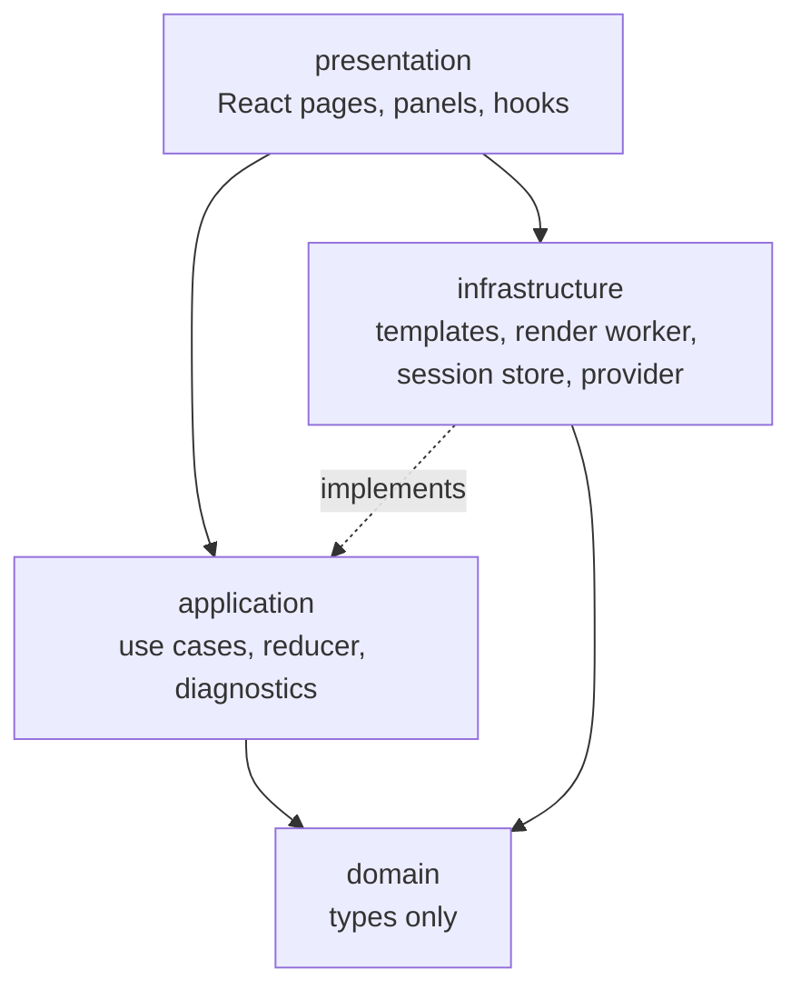
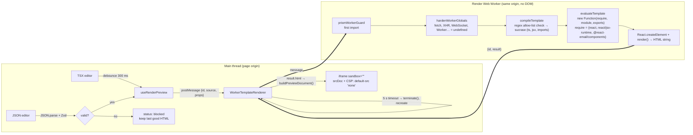
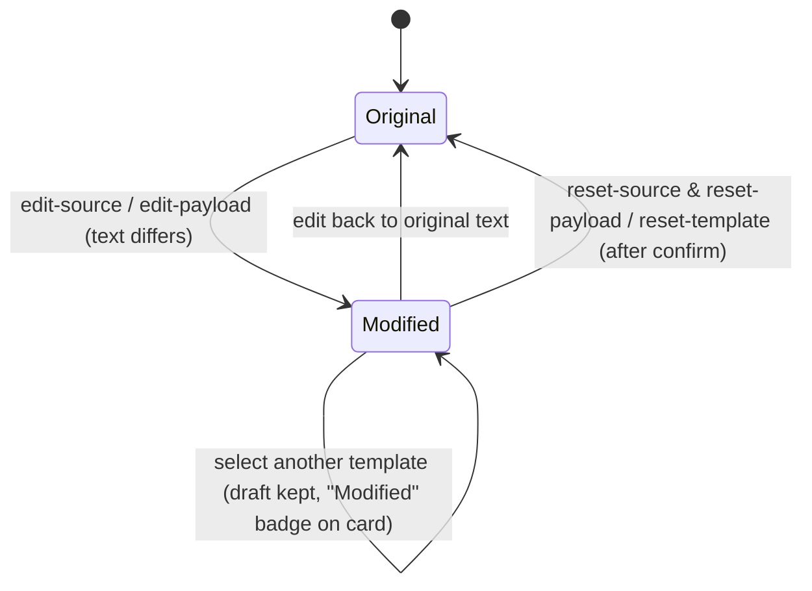
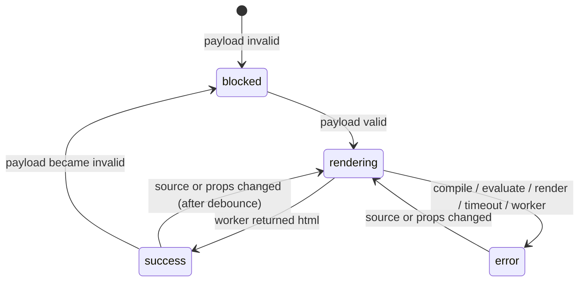

# Architecture

Practical layering, one page, no ceremony. The rule that matters: **dependencies point inwards**. `presentation` may import `application`, `domain` and `infrastructure`; `application` may import `domain` only; `domain` imports nothing; `infrastructure` implements interfaces the inner layers declare (for example `PropsValidator`, `TemplateRenderer`, `TemplateRepository`). `shared/` sits outside the layers: it is the wire contract, imported by the app, the Node server and the Worker alike, and may import only `zod`.

| Layer          | Folder               | Contains                                                                                                                                                                             | Must not contain                          |
| -------------- | -------------------- | ------------------------------------------------------------------------------------------------------------------------------------------------------------------------------------ | ----------------------------------------- |
| Domain         | `src/domain`         | `TemplateRecord` (`code` \| `visual`), `EmailTemplate`, `TemplateMetadata`, `TemplateEnvelope`, `EmailDocument`, `PreviewPayload`, `ValidationResult`, `RenderResult`, status unions | React, Zod, Tiptap, browser APIs, network |
| Application    | `src/application`    | `parsePreviewPayload`, `studioReducer` (select, edit, reset, device, mode), `studioModes`, `buildDiagnostics`, `repositories/` (ports: `TemplateRepository` and its result types)    | React, DOM, Zod                           |
| Infrastructure | `src/infrastructure` | Starter registry + Zod schemas, `templateMapper` (record → `EmailTemplate`), props validators, render pipeline and worker, session storage, no-send provider                         | UI                                        |
| Presentation   | `src/presentation`   | `StudioPage`, panels, dialogs, hooks (`useStudio`, `useRenderPreview`)                                                                                                               | Business rules (they live in application) |
| Shared         | `shared`             | `templateContracts.ts`: the request/response Zod schemas and size caps the browser, the Node server and the Worker all validate against                                              | Everything but `zod`                      |

## The preview pipeline

The one mechanism worth a picture: where user code runs, what it can reach, and how it is stopped.

### Why this design

- **Compile in the browser.** No server exists yet, and running arbitrary TSX on a shared server would be worse than running it in the author's own browser. sucrase is small (about 650 KB ESM), synchronous and worker-safe.
- **Web Worker.** Keeps the UI responsive, and gives the main thread a kill switch: `worker.terminate()` stops infinite loops that no `try/catch` could. The client recreates the worker lazily on the next request.
- **`require` shim.** After sucrase rewrites `import` to `require()`, the only modules that exist are the three in the map. Anything else throws a clear error. A regex pre-check gives a friendlier message earlier, but the shim is the actual boundary.
- **Hardened worker globals.** Workers share the page origin and could `fetch()` with the page's cookies. Before any template code runs, network-capable globals are replaced with `undefined` on the global object and its prototype chain (non-writable, non-configurable). Verified in E2E: `typeof fetch === 'undefined'` inside templates.
- **Sandboxed iframe + CSP.** `sandbox=""` removes scripts, forms, popups and same-origin access. The injected `Content-Security-Policy` meta forbids everything except inline styles, images and fonts. Rendered HTML from React Email contains no scripts anyway (asserted in E2E).
- **Last good render is kept.** When a new render fails or the payload is invalid, the preview shows the previous HTML with a banner rather than flashing empty.

### What code is allowed

- One file, default-exporting a React component. Named exports are ignored.
- Imports: `react`, `react/jsx-runtime` (implicit via JSX) and `@react-email/components`. Nothing else, including relative files.
- Any TypeScript syntax sucrase understands (types are stripped, **not checked**).
- Props come only from the validated JSON payload.

### Residual risks (read before exposing this to untrusted users)

1. A worker is **not a security boundary**. The hardening can be bypassed by a determined author only through browser bugs, but the worker still shares storage quotas and CPU with the page. Acceptable for teammates; not for anonymous users.
2. **Memory bombs** (e.g. building a multi-GB string) can crash the tab before the 5 s timeout fires.
3. The regex import check can be fooled by comments or template strings; the `require` shim still blocks execution, so this only affects the quality of the error message.
4. Types are not checked in the browser, so a template can compile and then throw at render time; the error is shown but not prevented.
5. The iframe CSP allows `img-src http:`; a template can therefore embed a tracking pixel that fires when previewed. Mail clients behave the same way; tighten to `https:` if preferred.

## State model

Studio state is a pure reducer (`application/studioState.ts`) wired to React by `useStudio`. Drafts are stored per template, so switching templates never discards edits, and an edit that returns to the original text clears the draft automatically.

Persistence: `sessionStorage` under `email-template-studio:v1`, validated with Zod on load, unknown template ids dropped.

Render status, derived (not stored) in `useRenderPreview`:

## Email provider boundary

`infrastructure/providers/emailProvider.ts` declares `EmailProvider` with `getStatus()` and `send()`. Two implementations exist:

- `HttpTestEmailProvider` (default): calls the local send server through the `/api` proxy and validates every response with Zod. When the server is absent or disabled it reports `connected: false` with a reason, and the dialog keeps the action disabled.
- `NoSendEmailProvider`: never connected; used in tests.

The send server (`server/`, Node + Hono) owns the SES call, the recipient policy (an allow-list, or any typed address), the `[TEST]` prefix, the rate limit and the dry-run mode. Credentials are resolved by the AWS SDK from the developer's profile; the repository never reads them. Details in `docs/SENDING.md`.

## Runtimes: one API, two hosts

`server/app.ts` is a plain Hono app that knows nothing about where it runs. Two adapters host it:

| Adapter           | Runs where                                       | Sender                                     | Host policy   |
| ----------------- | ------------------------------------------------ | ------------------------------------------ | ------------- |
| `server/node.ts`  | Node on the developer's machine, loopback only   | Amazon SES via the AWS SDK, or dry-run     | `loopback`    |
| `worker/index.ts` | Cloudflare Worker (workerd locally and deployed) | None or dry-run (phase 1 adds `aws4fetch`) | `same-origin` |

The rule from `docs/PLAN.md`: `server/` never imports `node:*` or `cloudflare:*`; the adapters do the platform work. `server/sesSender.ts` is the one exception (AWS SDK) and only the Node adapter imports it. Deployment details in `docs/DEPLOYMENT.md`.
