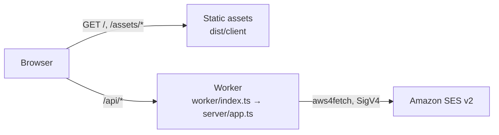

# Deployment

How the studio is deployed to Cloudflare, where it runs today, and what has to happen before it runs in a production account. Companion to `docs/PLAN.md` (the overall Cloudflare build plan) and `docs/SENDING.md` (test sends).

## Where it runs today

| Item               | Value                                                                                                                                                         |
| ------------------ | ------------------------------------------------------------------------------------------------------------------------------------------------------------- |
| URL                | https://email-template-studio.jerichodelrosario35.workers.dev                                                                                                 |
| Cloudflare account | **The developer's personal account** (Jericho del Rosario, Gmail login), account id `0f95923f7c5505d2e3261d3a788d68e0`, Workers Free plan                     |
| Worker name        | `email-template-studio`                                                                                                                                       |
| First deployed     | 2026-09-09, by hand from a laptop with `npm run deploy`, version `d131ab86`                                                                                   |
| Authentication     | **None.** Anyone with the URL can open the editor. There is nothing to protect yet: no stored data, no secrets, and sending is disabled                       |
| Sending            | Disabled (`STUDIO_SEND_ENABLED=false`). The Worker **can** send now (ADR-16), but this account must never hold AWS credentials. See "Turning live sending on" |
| Data               | None. Templates ship in the bundle; drafts live in the visitor's browser session                                                                              |

> **This is a temporary home.** The personal account was used so that the deployment pipeline could be built and verified without waiting for a company account. It must not receive AWS credentials, customer data or a custom domain. See "Moving to the production account" below; do it **before** phase 2 of `docs/PLAN.md` (D1 persistence), while there is still nothing to migrate.

## What gets deployed

One Cloudflare Worker with two parts (ADR-15 in `docs/DECISIONS.md`):

- **Static assets**: the Vite build of the studio (`dist/client`). Served by Cloudflare's asset layer, not billed as Worker requests. Unknown paths return `index.html` (single-page-app fallback).
- **The API**: `worker/index.ts` wraps the same Hono app the local Node send server uses (`server/app.ts`). Only `/api/*` reaches it (`run_worker_first` in `wrangler.jsonc`).



`npm run build` runs `wrangler types` (generates `worker-configuration.d.ts`, git-ignored), type-checks all four TypeScript projects, then `vite build` with the Cloudflare plugin, which writes `dist/client`, `dist/email_template_studio/index.js` and a resolved `wrangler.json` next to it. `wrangler deploy` reads that resolved config through `.wrangler/deploy/config.json`.

## Day-to-day commands

| Task                                  | Command                                      | Notes                                                                                |
| ------------------------------------- | -------------------------------------------- | ------------------------------------------------------------------------------------ |
| Check which account you are on        | `npx wrangler whoami`                        | Do this before every manual deploy until the production account exists               |
| Log in / switch account               | `npx wrangler login` / `npx wrangler logout` | Opens a browser; the token is stored under `~/.config/.wrangler`                     |
| Deploy                                | `npm run deploy`                             | Build then deploy; prints the URL and version id                                     |
| Roll back                             | `npx wrangler rollback`                      | Interactive; picks a previous version                                                |
| List versions                         | `npx wrangler versions list`                 |                                                                                      |
| Live logs                             | `npx wrangler tail`                          | Observability is enabled in `wrangler.jsonc`; logs also appear in the dashboard      |
| Run locally in the Cloudflare runtime | `npm run dev`                                | workerd next to Vite; variables from `.dev.vars` (see `.dev.vars.example`)           |
| Run locally with real SES sending     | `npm run dev` with keys in `.dev.vars`       | Same code path as production. `npm run dev:node` + `npm run server` is the Node path |
| Regenerate binding types              | `npm run cf:types`                           | After every change to `wrangler.jsonc`; `build` and `typecheck` do it anyway         |

## Environments

| Name                    | Where it is defined             | Purpose                                                                                   |
| ----------------------- | ------------------------------- | ----------------------------------------------------------------------------------------- |
| local                   | `.dev.vars` (git-ignored)       | `npm run dev` and `npm run preview`; sending disabled or dry-run                          |
| `e2e`                   | `wrangler.jsonc` → `env.e2e`    | Playwright only: dry-run sending with fake addresses; never deployed                      |
| top level               | `wrangler.jsonc` top-level keys | What `npm run deploy` deploys today (personal account)                                    |
| `staging`, `production` | to be added                     | Wrangler environments with their own D1, secrets and Access policy (PLAN.md phase 1 to 3) |

Rule: `vars` in `wrangler.jsonc` are for non-secret settings and are committed. Secrets go through `wrangler secret put` (or `.dev.vars` locally) and never into the file.

## Putting Cloudflare Access in front

Every `/api/*` route needs a caller the server can name. `server/auth.ts` verifies the
JSON Web Token that Cloudflare Access puts in the `Cf-Access-Jwt-Assertion` header, and
refuses the request with 401 when it cannot.

**The Worker verifies the token itself rather than trusting the header.** Access only
guards the hostname it is attached to; the `*.workers.dev` hostname stays reachable and
anyone can send a header of their own invention to it. Checking the signature against
the team's published keys is what turns that header into proof.

Four modes, chosen by environment variables. The first one that matches wins:

| Variables set                       | Mode                | Use                                                      |
| ----------------------------------- | ------------------- | -------------------------------------------------------- |
| `ACCESS_TEAM_DOMAIN` + `ACCESS_AUD` | `cloudflare-access` | Production. Verifies a real Access JWT.                  |
| `STUDIO_PASSWORD`                   | `password`          | A shared password, for a test deployment without Access. |
| `STUDIO_DEV_IDENTITY`               | `developer`         | Local and Playwright only. Trusts a fixed email.         |
| none of them                        | `disabled`          | Every `/api/*` request gets 401.                         |

The order is what makes this safe to leave configured: a forgotten `STUDIO_DEV_IDENTITY`
or `STUDIO_PASSWORD` can never downgrade a deployment that has real Access set up.
Setting only one of the two Access variables is refused outright rather than quietly
falling back to something weaker.

### The shared password gate

A stop-gap for a test deployment that needs _something_ in front of it before Access
exists. Be clear about what it is: it proves the caller knew a secret. It does **not**
say who they are, it cannot be revoked for one person without changing it for everyone,
and anyone told the password can pass it on. Move to Access before opening the recipient
policy (`SES_ALLOWED_RECIPIENTS=*`), and before anyone outside the team is told the
password.

What it does do properly: the password is exchanged once at `POST /api/session` for an
HttpOnly, `SameSite=Strict` cookie holding an HMAC of the session expiry — the password
itself is never stored in the cookie or readable by page scripts. Comparisons are
constant time, wrong guesses are throttled to 10 a minute, and sessions expire after 12
hours. The React sign-in screen is a convenience; the server refuses unauthenticated
`/api/*` requests whatever the browser renders.

```bash
# Generate one and store it as a secret. Minimum 12 characters; shorter is refused.
openssl rand -base64 24
npx wrangler secret put STUDIO_PASSWORD
```

It is a **secret**, so it goes through `wrangler secret put` and never into
`wrangler.jsonc`. Locally, put it in `.dev.vars`.

**1. Give the Worker a hostname in a zone you control.** Access cannot protect a
`*.workers.dev` URL; it needs a hostname in one of your Cloudflare zones. Add a custom
domain to the Worker (Workers & Pages -> your Worker -> Settings -> Domains & Routes),
for example `studio.swarm.work`.

**2. Create the Access application.** Zero Trust -> Access -> Applications -> Add an
application -> Self-hosted. Point it at the hostname from step 1 and add a policy that
allows the addresses or email domain that should get in.

**3. Copy the two identifiers.**

- **Team domain**: Zero Trust -> Settings -> Custom Pages, shown as `<team>.cloudflareaccess.com`.
- **Application Audience (AUD) tag**: on the application's Overview tab. It is an
  identifier, not a secret, but it is what stops a token minted for another application
  in the same team from being replayed against this one.

**4. Set them as `vars` for that environment** in `wrangler.jsonc` (neither is secret):

```jsonc
"vars": {
  "ACCESS_TEAM_DOMAIN": "yourteam.cloudflareaccess.com",
  "ACCESS_AUD": "8a7b6c5d4e3f...",
}
```

**5. Deploy and check.** A request with no token must be refused:

```bash
npm run deploy
curl -s https://studio.swarm.work/api/send-test/status   # through Access: 200 once signed in
curl -s https://email-template-studio.<subdomain>.workers.dev/api/send-test/status
# expect {"status":"error","code":"unauthenticated",...}
```

The second command is the one that matters: it proves the bypass hostname is closed.
Once Access is live, disable the `workers.dev` route entirely (Settings -> Domains &
Routes) so the only way in is through the protected hostname.

Locally, `npm run dev` has no Access in front of it, so put `STUDIO_DEV_IDENTITY=you@swarm.work`
in `.dev.vars` (see `.dev.vars.example`). Without it, the local API answers 401 as well.

## Turning live sending on

The Worker can reach Amazon SES (ADR-16). Whether it _does_ is one variable plus two secrets, per environment.

> **Read this first.** Do the Access setup above before turning sending on. A live SES key on a public Worker means anyone with the URL can trigger a send. Four further guards contain the damage: `SES_ALLOWED_RECIPIENTS` decides who may receive (a list, or `*` for any typed address), at most 10 recipients go out per send, every subject is prefixed `[TEST]`, and the rate limit is 5 sends per minute. Those are a backstop, not a substitute for authentication. Before using `*`, do two things in this order: turn the SES account suppression list on (`docs/SENDING.md`, "Free-form recipients"), and apply the widened IAM policy from step 1 below. A key whose attached policy still pins `ses:Recipients` refuses every new address with a 502 `AccessDeniedException`, which reads like a code regression rather than a policy one.

**1. Make the IAM user.** One user, no console access, one inline policy. The tracked copy is `infra/ses-policy.json`; apply it with `aws iam put-user-policy --user-name <user> --policy-name <name> --policy-document file://infra/ses-policy.json` after replacing `<account-id>` (and the region, identity and from-address if yours differ from this studio's). The policy is the real backstop: it is what stops a mistake or a stolen key from sending as anyone but the studio.

```json
{
  "Version": "2012-10-17",
  "Statement": [
    {
      "Sid": "SendOnlyAsTheStudioIdentity",
      "Effect": "Allow",
      "Action": "ses:SendEmail",
      "Resource": [
        "arn:aws:ses:ap-southeast-2:<account-id>:identity/swarm.camp",
        "arn:aws:ses:ap-southeast-2:<account-id>:configuration-set/<configuration-set>"
      ],
      "Condition": {
        "StringEquals": { "ses:FromAddress": "testing@swarm.camp" }
      }
    },
    {
      "Sid": "ReadOnlyPreflight",
      "Effect": "Allow",
      "Action": ["ses:GetAccount", "ses:GetEmailIdentity"],
      "Resource": "*"
    }
  ]
}
```

Replace the region, account id, identity, from-address and configuration-set name. There is deliberately no `ses:Recipients` condition: recipients are typed in the studio (ADR-17), so what the policy pins down is the sender. If you do want to pin recipients as well, add `"ForAllValues:StringEquals": { "ses:Recipients": [...] }` back to the first statement — and remember that it must then list every address in `SES_ALLOWED_RECIPIENTS`.

The configuration set is a second **resource**, not a condition. SES authorises a send against the identity and against whichever configuration set applies: the one named by `SES_CONFIGURATION_SET`, or, when that is unset, the account's default configuration set if one is marked as default in the SES console. If the set's ARN is missing from `Resource`, every send fails with `AccessDeniedException: ... is not authorized to perform 'ses:SendEmail' on resource '...:configuration-set/<name>'`, even though recipients and the sender are allowed. Keep the two names in step: the set in the policy and the value of `SES_CONFIGURATION_SET` (or the account default) must match, and set `SES_CONFIGURATION_SET` explicitly in `wrangler.jsonc` so the choice is visible in code rather than hidden in an account default.

**2. Set the non-secret variables** in `wrangler.jsonc` for that environment:

```jsonc
"vars": {
  "STUDIO_SEND_ENABLED": "true",
  "STUDIO_SEND_DRY_RUN": "false",
  // the same region and address the policy above pins, or SES denies every send
  "AWS_REGION": "ap-southeast-2",
  "SES_FROM_ADDRESS": "testing@swarm.camp",
  // a comma-separated list, or "*" for any address typed in the studio
  "SES_ALLOWED_RECIPIENTS": "you@swarm.camp,teammate@swarm.camp",
  "SES_CONFIGURATION_SET": "studio-events"
}
```

**3. Put the key in as secrets**, never in the file:

```bash
npx wrangler secret put AWS_ACCESS_KEY_ID
npx wrangler secret put AWS_SECRET_ACCESS_KEY
# only for temporary STS credentials, which expire and will break the Worker:
# npx wrangler secret put AWS_SESSION_TOKEN
```

**4. Deploy and check the preflight**, which asks SES directly and needs no send:

```bash
npm run deploy
curl -s https://<hostname>/api/send-test/status
```

Expect `"mode":"live"` and a `preflight.ok` of `true`. If `identityVerified` is false the sender is not verified in that region; if `sandbox` is true you can still only reach verified addresses.

**Rehearsal.** Setting `STUDIO_SEND_DRY_RUN=true` exercises the whole path, returns `dry-run-N` message ids and needs no credentials at all. Deploy that way first: it proves the config plumbing without any AWS risk.

### Rolling back the recipient policy

Opening sending up is one variable, and so is closing it again. In increasing severity:

1. Set `SES_ALLOWED_RECIPIENTS` back to a comma-separated list in `wrangler.jsonc` and `npm run deploy`. Anything off the list is refused again with `recipient-not-allowed`, and open tabs pick it up on their next status check.
2. `npx wrangler rollback <deployment-id>` to go back to the previous Worker version entirely.
3. `STUDIO_SEND_ENABLED: "false"` and deploy: the API answers `sending-disabled` and the dialog says so.
4. On the AWS side, `aws iam delete-access-key` for the Worker's key. Nothing can send until a new key is put in as a secret.

**Rotation.** Long-lived IAM keys should be rotated on a schedule. `wrangler secret put` with the same name overwrites in place, and the next request picks it up. There is no downtime and no code change.

## Continuous integration

`.github/workflows/ci.yml` runs on every push and pull request: typecheck, lint, unit tests, formatting, production build and the Playwright suite against the Cloudflare runtime.

The `deploy` job runs on pushes to `main` only when the `CLOUDFLARE_API_TOKEN` repository secret exists; otherwise it prints a notice and is skipped. To enable it:

1. In the Cloudflare dashboard, create an API token from the "Edit Cloudflare Workers" template, scoped to the one account.
2. `gh secret set CLOUDFLARE_API_TOKEN --repo Jericho0912/email-template-studio` (paste the token when prompted).
3. The `CLOUDFLARE_ACCOUNT_ID` repository variable is already set to the personal account; change it when the account changes.

Until then, deploys are manual with `npm run deploy`.

## Moving to the production account

**`docs/HANDOVER.md` is the runbook**: the company Cloudflare account, the company GitHub organisation, Access, staging and production environments, and retiring the personal deployment, step by step with a check after each one.

The short version, in order: transfer the GitHub repository, point wrangler at the company Cloudflare account and pin `account_id`, add `staging` and `production` environments with custom-domain routes, deploy staging in dry run, put Cloudflare Access in front, only then add the SES key and switch production to live, and finally delete the personal Worker.

Do it before D1 lands (PLAN.md phase 2), while there is nothing to migrate. If the move happens after: export with `npx wrangler d1 export <db> --output backup.sql` on the old account, create the database on the new one, apply migrations, and import the backup. Plan for a short freeze of edits during the switch.

## Post-deploy checks

Run after every deploy (CI will automate these later):

```bash
U=https://email-template-studio.jerichodelrosario35.workers.dev   # or the production hostname
curl -s -o /dev/null -w "%{http_code}\n" $U/                        # 200
curl -s -o /dev/null -w "%{http_code}\n" $U/some/deep/path          # 200 (SPA fallback)
curl -s $U/api/send-test/status                                     # {"enabled":false,...} until phase 1
curl -s -o /dev/null -w "%{http_code}\n" -X POST \
  -H "origin: https://attacker.example" -H "content-type: application/json" \
  -d '{}' $U/api/send-test                                          # 403 (cross-site refused)
```

Then open the URL in a browser: the welcome template must render in the preview frame and the header must say "Preview worker ready".

## Costs

Workers Free: 100 000 requests per day, static assets unlimited, no charge today. Workers Paid (USD 5 per month) becomes necessary for Queues (PLAN.md phase 4) and is recommended once teammates use the tool daily.
