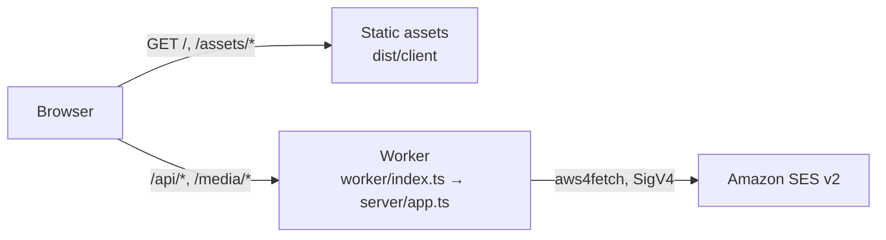

# Deployment

How the studio is deployed to Cloudflare, where it runs today, and what has to happen before it runs in a production account. Companion to `docs/PLAN.md` (the overall Cloudflare build plan) and `docs/SENDING.md` (test sends).

## Where it runs today

| Item               | Value                                                                                                                                                                                                                                                                                                                                                              |
| ------------------ | ------------------------------------------------------------------------------------------------------------------------------------------------------------------------------------------------------------------------------------------------------------------------------------------------------------------------------------------------------------------ |
| URL                | https://email-template-studio.swarm-work-emailer.workers.dev                                                                                                                                                                                                                                                                                                       |
| Cloudflare account | **`swarm-work-emailer`**, account id `d0fa6b3d72170539438800a907ec5323` (the one `wrangler.jsonc` pins), Workers Free plan. Verified with `npx wrangler whoami` on 2026-09-22: that id belongs to the account NAMED `swarm-work-emailer`, not to a personal account                                                                                                |
| Worker name        | `email-template-studio`                                                                                                                                                                                                                                                                                                                                            |
| First deployed     | 2026-09-09, by hand from a laptop with `npm run deploy`, version `d131ab86`                                                                                                                                                                                                                                                                                        |
| Authentication     | **The pages are open, the API is closed.** Anyone with the URL can open the editor; every `/api/*` route goes through `server/auth.ts`, and `STUDIO_PASSWORD` IS set on this Worker, so the mode is `password`. Checked on 2026-09-22: `/api/send-test/status` answered `401 {"mode":"password"}` to an anonymous caller. See "Putting Cloudflare Access in front" |
| Sending            | **Live.** The committed `wrangler.jsonc` sets `STUDIO_SEND_ENABLED=true` and `STUDIO_SEND_DRY_RUN=false` on this target, and the AWS keys are Worker secrets on it. `npm run deploy` with no `--env` deploys HERE, so it deploys to the live sender. See "Turning live sending on"                                                                                 |
| Data               | **Bound, but not yet created.** `database_id` is still the placeholder `00000000-0000-4000-8000-0000000000d1` and `npx wrangler d1 list` on this account returned nothing on 2026-09-22, so no REMOTE database or bucket exists. The studio has only ever run against local D1 under `.wrangler/state/v3`. See "Persistence (D1) and assets (R2)"                  |

> **Moving accounts is still free, and that is the news.** An earlier version of this note said "there is data now: D1 and R2 hold real rows and files, so moving is no longer a free action". That was wrong: no remote database or bucket has ever been created (see the Data row), so there is nothing to export. `docs/PRIORITIES.md` section 3.2 is the step that changes this — the moment a remote database exists, moving stops being free. Do the account decision first.

## What gets deployed

One Cloudflare Worker with two parts (ADR-15 in `docs/DECISIONS.md`):

- **Static assets**: the Vite build of the studio (`dist/client`). Served by Cloudflare's asset layer, not billed as Worker requests. Unknown paths return `index.html` (single-page-app fallback).
- **The API**: `worker/index.ts` wraps the same Hono app the local Node send server uses (`server/app.ts`). Only `/api/*` and `/media/*` reach it (`run_worker_first` in `wrangler.jsonc`).



`npm run build` runs `wrangler types` (generates `worker-configuration.d.ts`, git-ignored), type-checks all four TypeScript projects, then `vite build` with the Cloudflare plugin, which writes `dist/client`, `dist/email_template_studio/index.js` and a resolved `wrangler.json` next to it. `wrangler deploy` reads that resolved config through `.wrangler/deploy/config.json`.

## Day-to-day commands

| Task                                  | Command                                      | Notes                                                                                |
| ------------------------------------- | -------------------------------------------- | ------------------------------------------------------------------------------------ |
| Check which account you are on        | `npx wrangler whoami`                        | Do this before every manual deploy until the production account exists               |
| Log in / switch account               | `npx wrangler login` / `npx wrangler logout` | Opens a browser; the token is stored under `~/.config/.wrangler`                     |
| Deploy                                | `npm run deploy`                             | Build then deploy; prints the URL and version id                                     |
| Roll back                             | `npx wrangler rollback`                      | Interactive; picks a previous version                                                |
| List versions                         | `npx wrangler versions list`                 |                                                                                      |
| Live logs                             | `npx wrangler tail`                          | Observability is enabled in `wrangler.jsonc`; logs also appear in the dashboard      |
| Run locally in the Cloudflare runtime | `npm run dev`                                | workerd next to Vite; variables from `.dev.vars` (see `.dev.vars.example`)           |
| Run locally with real SES sending     | `npm run dev` with keys in `.dev.vars`       | Same code path as production. `npm run dev:node` + `npm run server` is the Node path |
| Regenerate binding types              | `npm run cf:types`                           | After every change to `wrangler.jsonc`; `build` and `typecheck` do it anyway         |
| Apply migrations locally              | `npm run db:migrate`                         | Do this once before the first `npm run dev`; see "Persistence (D1) and assets (R2)"  |
| Apply migrations to the real database | `npm run db:migrate:prod`                    | Always before `npm run deploy`, never after                                          |
| Query the local database              | `npm run db:console -- "SELECT 1"`           | Local SQLite under `.wrangler/state/v3`                                              |

## Environments

| Name                    | Where it is defined             | Purpose                                                                                                                                                                                                                                                   |
| ----------------------- | ------------------------------- | --------------------------------------------------------------------------------------------------------------------------------------------------------------------------------------------------------------------------------------------------------- |
| local                   | `.dev.vars` (git-ignored)       | `npm run dev` and `npm run preview`; sending disabled or dry-run                                                                                                                                                                                          |
| `e2e`                   | `wrangler.jsonc` → `env.e2e`    | Playwright only: dry-run sending with fake addresses, plus its own local D1 and R2; never deployed. Its `webServer` deletes every template and replays `0002` **and** `0003` before each run, so a run always starts from exactly the four starters at v1 |
| top level               | `wrangler.jsonc` top-level keys | What `npm run deploy` deploys today: the `swarm-work-emailer` account, live sender                                                                                                                                                                        |
| `staging`, `production` | to be added                     | Wrangler environments with their own D1, secrets and Access policy (PLAN.md phase 1 to 3). Bindings are **not** inherited by a named environment: repeat `d1_databases` and `r2_buckets` in each                                                          |

Rule: `vars` in `wrangler.jsonc` are for non-secret settings and are committed. Secrets go through `wrangler secret put` (or `.dev.vars` locally) and never into the file.

## Putting Cloudflare Access in front

Every `/api/*` route needs a caller the server can name. `server/auth.ts` verifies the
JSON Web Token that Cloudflare Access puts in the `Cf-Access-Jwt-Assertion` header, and
refuses the request with 401 when it cannot.

**The Worker verifies the token itself rather than trusting the header.** Access only
guards the hostname it is attached to; the `*.workers.dev` hostname stays reachable and
anyone can send a header of their own invention to it. Checking the signature against
the team's published keys is what turns that header into proof.

**Five** modes, chosen by environment variables. The first one that matches wins:

| Variables set                       | Mode                | Use                                                      |
| ----------------------------------- | ------------------- | -------------------------------------------------------- |
| `ACCESS_TEAM_DOMAIN` + `ACCESS_AUD` | `cloudflare-access` | Production. Verifies a real Access JWT.                  |
| `STYTCH_PROJECT_ID`                 | `stytch`            | Verifies a Stytch B2B session JWT (ADR-31).              |
| `STUDIO_PASSWORD`                   | `password`          | A shared password, for a test deployment without Access. |
| `STUDIO_DEV_IDENTITY`               | `developer`         | Local and Playwright only. Trusts a fixed email.         |
| none of them                        | `disabled`          | Every `/api/*` request gets 401.                         |

The order is what makes this safe to leave configured: a forgotten `STUDIO_DEV_IDENTITY`
or `STUDIO_PASSWORD` can never downgrade a deployment that has real Access set up.
Setting only one of the two Access variables is refused outright rather than quietly
falling back to something weaker. Stytch sits between Access and the password on
purpose: **removing `STYTCH_PROJECT_ID` and redeploying falls back to the password
gate**, which is the rollback lever, and it is rehearsed before it is needed rather
than discovered during an incident.

### Stytch

Set `STYTCH_PROJECT_ID` to the project id — it is public, it appears in the JWKS URL,
and it belongs in `wrangler.jsonc` vars rather than in a secret. The Worker downloads
Stytch's **public** keys and checks the signature itself; no Stytch secret is ever
needed at the edge, and none belongs in this repository.

Two things about this mode differ from the others and both will be noticed before they
are understood:

- **The token lives about five minutes.** The browser SDK refreshes it in the
  background, so the Worker legitimately sees expired tokens from tabs that were
  asleep and refuses them until the browser catches up. Do not widen
  `CLOCK_SKEW_SECONDS` to hide this: 60 seconds was nothing against a twelve-hour
  Access token and is a fifth of this one.
- **Signing out does not end the session immediately.** Verification is local, so an
  already-issued token keeps working until it expires. Removing someone from the
  Stytch organisation takes up to five minutes to bite. That is an accepted property,
  recorded in ADR-31.

A malformed `STYTCH_PROJECT_ID` fails **closed** with an explanation rather than
throwing, because a thrown error becomes a 500 the browser gate cannot interpret and
the studio would show a dead screen with no way in.

The browser half is not built yet: `docs/STYTCH_PLAN.md` tracks what remains.

### The shared password gate

A stop-gap for a test deployment that needs _something_ in front of it before Access
exists. Be clear about what it is: it proves the caller knew a secret. It does **not**
say who they are, it cannot be revoked for one person without changing it for everyone,
and anyone told the password can pass it on. Move to Access before opening the recipient
policy (`SES_ALLOWED_RECIPIENTS=*`), and before anyone outside the team is told the
password.

What it does do properly: the password is exchanged once at `POST /api/session` for an
HttpOnly, `SameSite=Strict` cookie holding an HMAC of the session expiry — the password
itself is never stored in the cookie or readable by page scripts. Comparisons are
constant time, wrong guesses are throttled to 10 a minute, and sessions expire after 12
hours. The React sign-in screen is a convenience; the server refuses unauthenticated
`/api/*` requests whatever the browser renders.

```bash
# Generate one and store it as a secret. Minimum 12 characters; shorter is refused.
openssl rand -base64 24
npx wrangler secret put STUDIO_PASSWORD
```

It is a **secret**, so it goes through `wrangler secret put` and never into
`wrangler.jsonc`. Locally, put it in `.dev.vars`.

**1. Give the Worker a hostname in a zone you control.** Access cannot protect a
`*.workers.dev` URL; it needs a hostname in one of your Cloudflare zones. Add a custom
domain to the Worker (Workers & Pages -> your Worker -> Settings -> Domains & Routes),
for example `studio.swarm.work`.

**2. Create the Access application.** Zero Trust -> Access -> Applications -> Add an
application -> Self-hosted. Point it at the hostname from step 1 and add a policy that
allows the addresses or email domain that should get in.

**3. Copy the two identifiers.**

- **Team domain**: Zero Trust -> Settings -> Custom Pages, shown as `<team>.cloudflareaccess.com`.
- **Application Audience (AUD) tag**: on the application's Overview tab. It is an
  identifier, not a secret, but it is what stops a token minted for another application
  in the same team from being replayed against this one.

**4. Set them as `vars` for that environment** in `wrangler.jsonc` (neither is secret):

```jsonc
"vars": {
  "ACCESS_TEAM_DOMAIN": "yourteam.cloudflareaccess.com",
  "ACCESS_AUD": "8a7b6c5d4e3f...",
}
```

**5. Deploy and check.** A request with no token must be refused:

```bash
npm run deploy
curl -s https://studio.swarm.work/api/send-test/status   # through Access: 200 once signed in
curl -s https://email-template-studio.<subdomain>.workers.dev/api/send-test/status
# expect {"status":"error","code":"unauthenticated",...}
```

The second command is the one that matters: it proves the bypass hostname is closed.
Once Access is live, disable the `workers.dev` route entirely (Settings -> Domains &
Routes) so the only way in is through the protected hostname.

Locally, `npm run dev` has no Access in front of it, so put `STUDIO_DEV_IDENTITY=you@swarm.work`
in `.dev.vars` (see `.dev.vars.example`). Without it, the local API answers 401 as well.

## Turning live sending on

The Worker can reach Amazon SES (ADR-16). Whether it _does_ is one variable plus two secrets, per environment.

> **Read this first.** Do the Access setup above before turning sending on. A live SES key on a public Worker means anyone with the URL can trigger a send. Four further guards contain the damage: `SES_ALLOWED_RECIPIENTS` decides who may receive (a list, or `*` for any typed address), at most 10 recipients go out per send, every subject is prefixed `[TEST]`, and the rate limit is 5 sends per minute. Those are a backstop, not a substitute for authentication. Before using `*`, do two things in this order: turn the SES account suppression list on (`docs/SENDING.md`, "Free-form recipients"), and apply the widened IAM policy from step 1 below. A key whose attached policy still pins `ses:Recipients` refuses every new address with a 502 `AccessDeniedException`, which reads like a code regression rather than a policy one.

**1. Make the IAM user.** One user, no console access, one inline policy. The tracked copy is `infra/ses-policy.json`; apply it with `aws iam put-user-policy --user-name <user> --policy-name <name> --policy-document file://infra/ses-policy.json` after replacing `<account-id>` (and the region, identity and from-address if yours differ from this studio's). The policy is the real backstop: it is what stops a mistake or a stolen key from sending as anyone but the studio.

```json
{
  "Version": "2012-10-17",
  "Statement": [
    {
      "Sid": "SendOnlyAsTheStudioIdentity",
      "Effect": "Allow",
      "Action": "ses:SendEmail",
      "Resource": [
        "arn:aws:ses:ap-southeast-2:<account-id>:identity/swarm.camp",
        "arn:aws:ses:ap-southeast-2:<account-id>:configuration-set/<configuration-set>"
      ],
      "Condition": {
        "StringEquals": { "ses:FromAddress": "testing@swarm.camp" }
      }
    },
    {
      "Sid": "ReadOnlyPreflight",
      "Effect": "Allow",
      "Action": ["ses:GetAccount", "ses:GetEmailIdentity"],
      "Resource": "*"
    }
  ]
}
```

Replace the region, account id, identity, from-address and configuration-set name. There is deliberately no `ses:Recipients` condition: recipients are typed in the studio (ADR-17), so what the policy pins down is the sender. If you do want to pin recipients as well, add `"ForAllValues:StringEquals": { "ses:Recipients": [...] }` back to the first statement — and remember that it must then list every address in `SES_ALLOWED_RECIPIENTS`.

The configuration set is a second **resource**, not a condition. SES authorises a send against the identity and against whichever configuration set applies: the one named by `SES_CONFIGURATION_SET`, or, when that is unset, the account's default configuration set if one is marked as default in the SES console. If the set's ARN is missing from `Resource`, every send fails with `AccessDeniedException: ... is not authorized to perform 'ses:SendEmail' on resource '...:configuration-set/<name>'`, even though recipients and the sender are allowed. Keep the two names in step: the set in the policy and the value of `SES_CONFIGURATION_SET` (or the account default) must match, and set `SES_CONFIGURATION_SET` explicitly in `wrangler.jsonc` so the choice is visible in code rather than hidden in an account default.

**2. Set the non-secret variables** in `wrangler.jsonc` for that environment:

```jsonc
"vars": {
  "STUDIO_SEND_ENABLED": "true",
  "STUDIO_SEND_DRY_RUN": "false",
  // the same region and address the policy above pins, or SES denies every send
  "AWS_REGION": "ap-southeast-2",
  "SES_FROM_ADDRESS": "testing@swarm.camp",
  // a comma-separated list, or "*" for any address typed in the studio
  "SES_ALLOWED_RECIPIENTS": "you@swarm.camp,teammate@swarm.camp",
  "SES_CONFIGURATION_SET": "studio-events"
}
```

**3. Put the key in as secrets**, never in the file:

```bash
npx wrangler secret put AWS_ACCESS_KEY_ID
npx wrangler secret put AWS_SECRET_ACCESS_KEY
# only for temporary STS credentials, which expire and will break the Worker:
# npx wrangler secret put AWS_SESSION_TOKEN
```

**4. Deploy and check the preflight**, which asks SES directly and needs no send:

```bash
npm run deploy
curl -s https://<hostname>/api/send-test/status
```

Expect `"mode":"live"` and a `preflight.ok` of `true`. If `identityVerified` is false the sender is not verified in that region; if `sandbox` is true you can still only reach verified addresses.

**Rehearsal.** Setting `STUDIO_SEND_DRY_RUN=true` exercises the whole path, returns `dry-run-N` message ids and needs no credentials at all. Deploy that way first: it proves the config plumbing without any AWS risk.

### Rolling back the recipient policy

Opening sending up is one variable, and so is closing it again. In increasing severity:

1. Set `SES_ALLOWED_RECIPIENTS` back to a comma-separated list in `wrangler.jsonc` and `npm run deploy`. Anything off the list is refused again with `recipient-not-allowed`, and open tabs pick it up on their next status check.
2. `npx wrangler rollback <deployment-id>` to go back to the previous Worker version entirely.
3. `STUDIO_SEND_ENABLED: "false"` and deploy: the API answers `sending-disabled` and the dialog says so.
4. On the AWS side, `aws iam delete-access-key` for the Worker's key. Nothing can send until a new key is put in as a secret.

**Rotation.** Long-lived IAM keys should be rotated on a schedule. `wrangler secret put` with the same name overwrites in place, and the next request picks it up. There is no downtime and no code change.

## Persistence (D1) and assets (R2)

Templates live in a Cloudflare D1 database (`STUDIO_DB`); images uploaded into a visual template live in an R2 bucket (`STUDIO_ASSETS`). Both are bound in `wrangler.jsonc`, and **both live on the account `wrangler.jsonc` pins** — the same account the Worker deploys to (ADR-21). Without a binding the Worker still boots: the template routes answer `503 storage-unavailable` and sending keeps working. The reverse holds too — a broken send configuration only disables `/api/send-test`; templates, uploads and `GET /media/:key` keep working.

**Where an uploaded image is served from.** `POST /api/uploads` stores the file in R2 under `img_<uuid>.<ext>` and answers with the absolute URL `https://<host>/media/img_<uuid>.<ext>` — absolute because the `` ends up in someone's inbox, where there is no page for a relative path to be resolved against. The bytes behind a key never change, so `GET /media/:key` sends `cache-control: public, max-age=31536000, immutable`; a new image gets a new key. The prefix is `/media/` and **not** `/assets/` on purpose: Vite builds the studio's own JS, CSS and fonts into `/assets/`, and `run_worker_first` only lists `/api/*` and `/media/*`, so every static build asset is answered by the asset layer without ever costing a Worker invocation.

**The database is bound, but the API in front of it is closed.** Deploy, `curl https://…/api/templates` and you get `401`, because no `ACCESS_*` and no `STUDIO_PASSWORD` are set (see "Putting Cloudflare Access in front"). That is the right default; it is also the first thing to trip over after following the setup below to the letter.

### One-time setup

```bash
npx wrangler whoami                                            # confirm the account FIRST
npx wrangler d1 create email-template-studio                   # prints database_id
npx wrangler r2 bucket create email-template-studio-assets
npx wrangler r2 bucket create email-template-studio-assets-e2e # Playwright's bucket
```

Paste the printed `database_id` over the placeholder `00000000-0000-4000-8000-0000000000d1` in `wrangler.jsonc`, then `npm run cf:types`. The `env.e2e` database id (`…0000000000e2`) is a local-only fixture and stays as it is — the e2e database is never created remotely.

`preview_database_id` is deliberately **never** set. Local dev, `npm run preview`, `vite preview` and `wrangler d1 … --local` then all share one SQLite file under `.wrangler/state/v3`, keyed by `database_id`, so what you migrate on the command line is what the Worker sees. `.wrangler/` is git-ignored.

### Migrations

| Task                       | Command                                           | Notes                                                       |
| -------------------------- | ------------------------------------------------- | ----------------------------------------------------------- |
| Apply locally              | `npm run db:migrate`                              | `.wrangler/state/v3`; run this before `npm run dev`         |
| Apply to the e2e database  | `npm run db:migrate:e2e`                          | Playwright's `webServer` does it for you                    |
| Apply to the real database | `npm run db:migrate:prod`                         | `--remote`. Needs D1 Edit on the token                      |
| Ad-hoc query (local)       | `npm run db:console -- "SELECT * FROM templates"` | Read-only by convention, not by enforcement                 |
| Regenerate the seed        | `npm run seed:generate`                           | After editing a starter; the drift test fails if you forget |

Migration files are numbered and applied in order; wrangler records which have run. **Migrations are never rolled back** (ADR-21): to undo something, write the next migration.

**`npm run db:migrate` is now a prerequisite for `npm run dev`.** Since phase 7b the browser reads and writes templates through the API (`VITE_DATA_MODE` defaults to `http`, ADR-27), so a studio started against an unmigrated database shows "Templates could not be loaded" instead of a library — the first query hits tables that are not there, which the API answers as a 500. ("Template storage is unavailable" is the other failure: a server with no D1 binding at all, which answers 503.) The escape hatch is `VITE_DATA_MODE=memory npm run dev`: the studio then runs entirely in the browser with the starters loaded from `registry.ts`, saves nothing, and needs no database at all. It is meant for a quick look at the UI, not for work you want to keep.

**Migrate before you deploy.** CI does this — the `Apply D1 migrations` step runs before `Deploy to Cloudflare`, gated on the same `CLOUDFLARE_API_TOKEN`. By hand the release is `npm run db:migrate:prod && npm run deploy`.

**Migrations must stay backward compatible with the deployed Worker**, because for the seconds between the two steps the old Worker is talking to the new schema. Adding a table, an index or a nullable column is safe. Renaming or dropping a column is a two-release change: add the new one and write to both, deploy, backfill, then drop the old one in a later release.

### Verified on local D1 (2026-09-18)

The plan listed two D1 behaviours as unproven. Both were checked against the **local** workerd SQLite (`.wrangler/state/v3`), through a throwaway Worker with the real binding; **re-run them against `--remote` once the database exists**:

| Question                                                          | Result                                                                                                                                                                                                                                  |
| ----------------------------------------------------------------- | --------------------------------------------------------------------------------------------------------------------------------------------------------------------------------------------------------------------------------------- |
| Does `UPDATE … RETURNING` work?                                   | **Yes** — `UPDATE templates SET revision = revision + 1 … RETURNING revision` returned `[{ revision: 2 }]`. Verified locally; re-run against `--remote` once the database exists                                                        |
| Does a 500 KB **bound parameter** hit the 100 KB statement limit? | **No** — a 500 KB string bound with `.bind(...)` inserted and read back at exactly 500,000 characters. The 100 KB limit is on statement text, not on bound values. Verified locally; re-run against `--remote` once the database exists |

Two further facts were confirmed the same way, and again through the production build (`vite preview` + curl): a guarded `UPDATE` that matches nothing reports `meta.changes === 0`, and `ON DELETE CASCADE` removes a template's versions with it.

The store does **not** rely on `RETURNING`: every write is a `db.batch(...)` whose conflict detection uses `meta.changes`, followed by a re-read. If `RETURNING` behaves differently on remote D1, nothing breaks.

### Backups and restore

```bash
npx wrangler d1 export STUDIO_DB --remote --output backup-$(date +%F).sql   # before every migration
npx wrangler d1 execute STUDIO_DB --remote --file backup-2026-09-18.sql     # import into a fresh database
```

For "it was fine ten minutes ago", D1 **Time Travel** restores to a point in the last 30 days without a backup file:

```bash
npx wrangler d1 time-travel info STUDIO_DB                                  # current bookmark
npx wrangler d1 time-travel restore STUDIO_DB --timestamp 2026-09-18T09:00:00Z
```

Time Travel is a restore of the whole database, not of one row. Take an export first if the current state might still be wanted.

R2 has no Time Travel. The bucket holds only uploaded images, which are content-addressed by an immutable key, so the recovery story is "re-upload"; copy a bucket with `npx wrangler r2 object get/put` or `rclone` if it ever has to move.

### Token permissions

The `CLOUDFLARE_API_TOKEN` used by CI (and by anyone deploying by hand) needs, on the one account:

- **Workers Scripts: Edit** — deploy
- **D1: Edit** — `migrations apply --remote`
- **Workers R2 Storage: Edit** — uploads

The "Edit Cloudflare Workers" template does not include D1 or R2; add both to the token, or the migrate step fails with a permission error while the deploy succeeds.

### Rollback

| What went wrong                          | What to do                                                                                                                                                                 |
| ---------------------------------------- | -------------------------------------------------------------------------------------------------------------------------------------------------------------------------- |
| Bad Worker version                       | `npx wrangler rollback`, or redeploy the previous commit. The schema is left alone — migrations are additive, so the older Worker still reads it                           |
| Bad data (a wrong bulk edit, a deletion) | D1 Time Travel to just before it, or import the last export. Template history is append-only, so a bad **save** is recoverable by reading the previous version             |
| Bad migration                            | Never "roll back" a migration. Write the next one that undoes it, test it locally with `npm run db:migrate`, then apply it                                                 |
| Visual editor misbehaving                | Set `STUDIO_VISUAL_EDITOR` to `"false"` in `wrangler.jsonc` and `npx wrangler deploy`. See below — it is a variable change, not a rebuild, and it keeps templates readable |

#### Switching the visual editor off

`STUDIO_VISUAL_EDITOR` is a Worker `var`, read by `server/config.ts` and reported to the browser in
`GET /api/send-test/status` as `features.visualEditor`. Only the literal string `"false"` switches it
off; anything else, including an absent variable, leaves it on, so a typo can never take the editor
away by accident.

With it off:

- the **Visual** button in the mode toggle is disabled and says why (it stays on screen and stays
  focusable, so a keyboard reader can reach the explanation);
- a visual template opens in **Preview** with the banner _"The visual editor is switched off. This
  template is read-only until it is switched back on."_;
- the 2.5 MB editor chunk is **never requested** — the studio waits for the status response before it
  mounts the canvas, so a broken editor build cannot even be downloaded;
- the preview shows the HTML and plain text saved with the current version; a template that has
  never been saved — including the seeded starter, which ships with an empty export because the
  studio composes it on open — has nothing to show, so the banner is the only thing on screen;
- code templates are completely unaffected.

Nothing is written while it is off, so switching it back on (`"true"`, or delete the variable) and
redeploying restores the canvas exactly as it was. A rollback of the whole Worker
(`npx wrangler rollback`) does the same thing more bluntly; prefer the flag when only the editor is
the problem.

Pre-deploy checklist: `npm run check` green → `npm run build` green (the Worker-bundle guard runs here) → `npx wrangler whoami` shows the right account → `wrangler d1 export --remote` taken → `npm run db:migrate:prod` → `npm run deploy` → the post-deploy checks below.

## Continuous integration

`.github/workflows/ci.yml` runs on every push and pull request: typecheck, lint, unit tests, formatting, production build and the Playwright suite against the Cloudflare runtime.

The `deploy` job runs on pushes to `main` only when the `CLOUDFLARE_API_TOKEN` repository secret exists; otherwise it prints a notice and is skipped. To enable it:

1. In the Cloudflare dashboard, create an API token from the "Edit Cloudflare Workers" template, scoped to the one account, and **add D1: Edit and Workers R2 Storage: Edit** (the template has neither).
2. `gh secret set CLOUDFLARE_API_TOKEN --repo Jericho0912/email-template-studio` (paste the token when prompted).
3. **The `CLOUDFLARE_ACCOUNT_ID` repository variable does not match `wrangler.jsonc`.** Checked on 2026-09-22: the variable is `0f95923f7c5505d2e3261d3a788d68e0`, while `wrangler.jsonc` pins `d0fa6b3d72170539438800a907ec5323` (`swarm-work-emailer`). Nothing has caught this because no `CLOUDFLARE_API_TOKEN` secret exists, so the deploy job has never run. Fix the variable before arming that token, or the first CI deploy goes somewhere nobody has checked.

The deploy job applies D1 migrations (`d1 migrations apply STUDIO_DB --remote`) before deploying, gated on the same secret.

Until the secret exists, releases are manual: `npm run db:migrate:prod && npm run deploy`.

## Moving to the production account

**`docs/HANDOVER.md` is the runbook**: the company Cloudflare account, the company GitHub organisation, Access, staging and production environments, and retiring the personal deployment, step by step with a check after each one.

The short version, in order: transfer the GitHub repository, point wrangler at the company Cloudflare account and pin `account_id`, add `staging` and `production` environments with custom-domain routes, deploy staging in dry run, put Cloudflare Access in front, only then add the SES key and switch production to live, and finally delete the personal Worker.

D1 and R2 now exist on the pinned account (ADR-21), so the move has data in it. The path:

```bash
npx wrangler d1 export STUDIO_DB --remote --output move.sql     # old account
npx wrangler login                                              # new account
npx wrangler d1 create email-template-studio                    # paste the new id into wrangler.jsonc
npx wrangler r2 bucket create email-template-studio-assets
npm run db:migrate:prod                                         # schema first
npx wrangler d1 execute STUDIO_DB --remote --file move.sql      # then the data
```

Copy the R2 objects across with `npx wrangler r2 object get/put` or `rclone` (the keys are immutable, so the URLs already in saved templates keep working once the bucket is populated). Plan for a short freeze of edits during the switch.

## Post-deploy checks

Run after every deploy (CI will automate these later):

```bash
U=https://email-template-studio.jerichodelrosario35.workers.dev   # or the production hostname
curl -s -o /dev/null -w "%{http_code}\n" $U/                        # 200
curl -s -o /dev/null -w "%{http_code}\n" $U/some/deep/path          # 200 (SPA fallback)
curl -s $U/api/send-test/status                                     # {"enabled":false,...} until phase 1
curl -s -o /dev/null -w "%{http_code}\n" -X POST \
  -H "origin: https://attacker.example" -H "content-type: application/json" \
  -d '{}' $U/api/send-test                                          # 403 (cross-site refused)
```

Then open the URL in a browser: the welcome template must render in the preview frame and the header must say "Preview worker ready".

## Costs

Workers Free: 100 000 requests per day, static assets unlimited, no charge today. Workers Paid (USD 5 per month) becomes necessary for Queues (PLAN.md phase 4) and is recommended once teammates use the tool daily.
