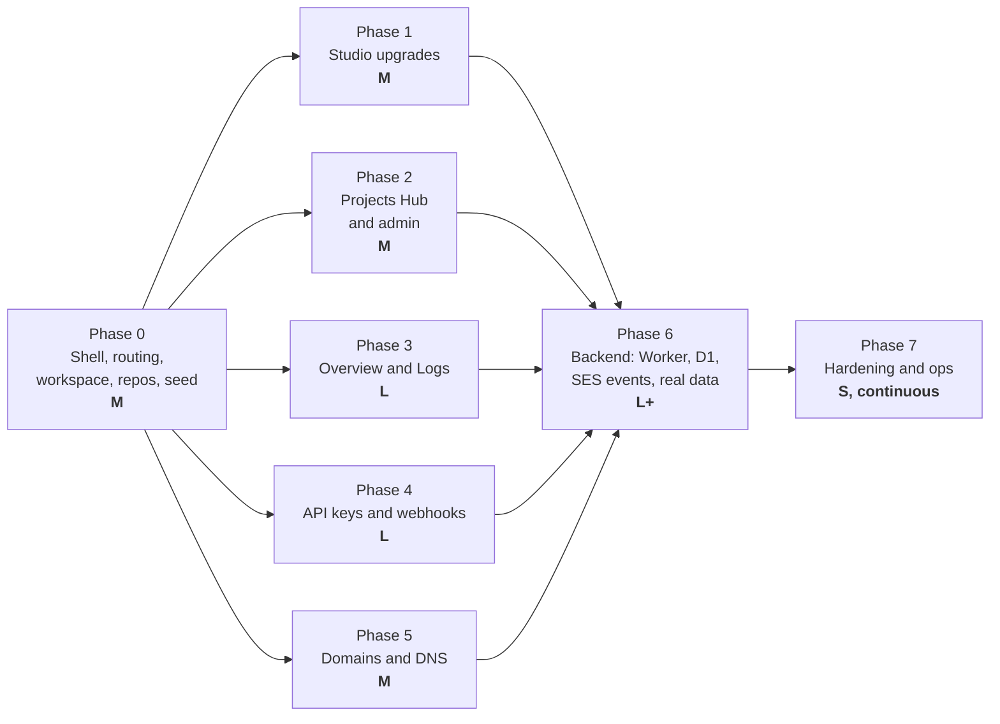

# Feature plan: from the Template Studio to the full sending platform

Written 2026-09-09. This document turns the Resend-inspired feature list (four screens, a multi-project hierarchy, and an eleven-entity data model) into an ordered plan that builds on what already exists. It is the working backlog for the next milestones; `docs/ROADMAP.md` keeps the one-line milestone table, and `docs/PLAN.md` (branch `docs/cloudflare-build-plan`) keeps the hosting and backend details.

How to read it:

1. **Section 1** says where we stand and which decisions this plan takes (with "change this if" notes).
2. **Section 2** is the reality check: which parts of the wish list Amazon SES can actually back, and what to rename.
3. **Section 3** is the delivery order. Every later section hangs off it.
4. **Sections 4 to 9** are the feature cards, one per screen, each with tasks, dependencies and a "done when".
5. **Section 10** maps the entity list to TypeScript types and a D1 schema.
6. **Section 11** lists the cross-cutting work (routing, workspace context, repositories, seed data, testing).
7. **Section 12** lists questions only you can answer.

## 1. Where we stand and the decisions this plan takes

### What exists (verified 2026-09-09)

> **Out of date on purpose**: this table is the snapshot the plan was written against. Every row of it
> moved in the visual-editor work — there are two template kinds and a canvas, drafts have a server
> revision behind them, persistence is D1 and telemetry is a render report. See the status note in
> section 4 and `README.md`.

| Area                   | State                                                                                                                                              |
| ---------------------- | -------------------------------------------------------------------------------------------------------------------------------------------------- |
| Template Studio        | Done as one page: TSX + JSON editors (CodeMirror), worker render pipeline, sandboxed preview, desktop/mobile toggle, diagnostics, template library |
| Templates              | Three (welcome-verification, password-reset, team-invitation) in `src/infrastructure/templates/registry.ts`, with Zod props schemas                |
| Drafts                 | Per-template drafts in `sessionStorage`, pure reducer in `src/application/studioState.ts`                                                          |
| Test sending           | Local Hono server (`server/`) calling Amazon SES, allow-listed recipients, `[TEST]` prefix, dry run                                                |
| Shell                  | Header with a decorative workspace dropdown and environment badge; nav items are static; no router                                                 |
| Persistence, telemetry | None                                                                                                                                               |
| Backend hosting        | Planned in `docs/PLAN.md` (one Cloudflare Worker, Hono, D1, Queues, Access), not started                                                           |
| Tests                  | Vitest unit + component tests, Playwright E2E on the production build                                                                              |

### What the feature list adds

Everything in the list except the Studio screen is new surface area, and every new screen needs data the app does not have. That is the central planning problem: **the UI can be built in weeks, but the data behind it (delivery events, DNS verification, webhook dispatches) only exists once the backend and SES integration exist.**

The plan resolves this by putting a **repository interface** between every screen and its data, with two implementations: an in-memory one fed by a deterministic seed (available from day one, used by tests), and an HTTP one talking to the Worker API (arrives with the backend phase). Screens are built and verified against seed data, then switched over without UI changes.

### Decisions

Defaults chosen so the work can start. Each has a "change this if" so they are easy to revisit. They will become ADRs 15 to 26 in `docs/DECISIONS.md` when implemented.

| #   | Topic               | Decision                                                                                                                                                                                  | Change this if                                                                                                     |
| --- | ------------------- | ----------------------------------------------------------------------------------------------------------------------------------------------------------------------------------------- | ------------------------------------------------------------------------------------------------------------------ |
| 15  | Routing             | **React Router 7** in library mode (`react-router`), routes under `/:org/:project/:env/...`                                                                                               | You want end-to-end typed routes: TanStack Router. More concepts to learn; not needed for five screens.            |
| 16  | Server state        | **TanStack Query 5** for everything that comes from a repository: loading, errors, caching, polling, pagination                                                                           | Never. Hand-rolling this is where beginner React apps rot.                                                         |
| 17  | Data access         | **Repository interfaces** in `src/application/repositories/`, `InMemory*` (seeded) and `Http*` implementations in `src/infrastructure/`. Mode picked in `App.tsx` by `VITE_DATA_MODE`.    | Never; this is what makes the UI-first order possible.                                                             |
| 18  | Workspace context   | Organization, project and environment come from the **URL**, read by one `useWorkspace()` hook. Last visited workspace remembered in `localStorage` for the `/` redirect.                 | Deep links are not wanted. (They are: every log row and template needs a shareable URL.)                           |
| 19  | Environment         | An **Environment is a data row** (`environments` table, `env_id` on domains, keys, webhooks, messages) inside one deployment. The app's own staging/production deploy is a separate axis. | You only ever need one environment per project; then drop the switcher and keep the column.                        |
| 20  | Multi-project UI    | **Both options**: the header switcher (Option 1) is the context; the Projects Hub (Option 2) is the landing page at `/` and the admin view.                                               | Time is short: ship Option 1 only; the hub is a nicer `/` page, not a dependency.                                  |
| 21  | Code editor         | Keep **CodeMirror 6** (ADR-5). The "Monaco" in the wish list is a placeholder for "a real editor"; Monaco is ten times larger and needs its own worker setup.                             | You need in-browser TypeScript type checking; then evaluate Monaco or a TS language service in a worker.           |
| 22  | Charts              | **Hand-written SVG** for the sparkline and the radial gauge (two small components). No chart library.                                                                                     | A real time-series chart with axes and tooltips is requested; then add Recharts and read `dataviz` guidance first. |
| 23  | Syntax highlighting | CodeMirror read-only view + `@codemirror/legacy-modes` for Python, Go, Ruby and shell in the SDK snippets                                                                                 | Snippets grow beyond five languages; then consider Shiki (bigger, prettier).                                       |
| 24  | Forms               | Plain React state + Zod `safeParse` on submit, shared `FieldError` component                                                                                                              | Forms multiply past five or need arrays of fields; then add react-hook-form with its Zod resolver.                 |
| 25  | "Real-time"         | TanStack Query `refetchInterval` (5 s) on the log and metrics while the tab is visible                                                                                                    | Polling cost matters; then a Server-Sent Events endpoint from the Worker.                                          |
| 26  | Backend             | As in `docs/PLAN.md`: one Cloudflare Worker, Hono, D1 with plain SQL, Queues, Cloudflare Access. New tables from section 10.                                                              | See the risks table in `docs/PLAN.md`.                                                                             |

> **What the visual-editor work did with these, decision by decision (2026-09-19).**
>
> - **Followed:** #17 repository interfaces — `TemplateRepository` in `src/application/repositories/`,
>   with `InMemoryTemplateRepository` and `HttpTemplateRepository`, one contract suite run against
>   both, and the mode picked in `App.tsx` by `VITE_DATA_MODE` (ADR-20, ADR-27). #21 CodeMirror 6 was
>   kept, and `Type checking: Planned` is on screen rather than implied (ADR-5). #22 hand-written SVG:
>   the render report's sparkline is about 40 lines and there is still no chart library. #24 plain
>   React state plus Zod on submit, in every dialog this work added. #26 backend — one Worker, Hono,
>   D1, plain SQL; Queues and Access are not reached yet.
> - **Deviated from:** **#16 TanStack Query — still deferred**, for the second time. The studio reads
>   the library with a plain `fetch` and a `useReducer` in `useTemplateLibrary`; ADR-27 records why
>   (one list request, no polling, no cache invalidation to get wrong) and what would change the
>   answer. #23 syntax highlighting: the read-only tabs use CodeMirror's HTML mode, and there are no
>   SDK snippets to highlight yet. #25 "real-time": nothing polls, so there is nothing to refetch.
> - **Not reached:** #15 routing (there is still no router — `TemplatesRoute` is a switch inside
>   `App.tsx` shaped like the future `/templates/:id`), #18 workspace context (the header shows a
>   static workspace label), #19 environments as data rows, #20 the Projects Hub. Everything here is
>   single-tenant behind one shared password.
> - **Superseded:** section 10's `EmailTemplate` table — see the note there. The column names and the
>   split into `templates` + `template_versions` were decided in ADR-21 and ADR-22 instead.

## 2. Reality check: what Amazon SES can back

The wish list was written against Resend's dashboard. Our provider is SES, so some items need renaming or a different data source. Build the UI to the data we can get, not to the screenshot.

| Wish-list item                                 | SES reality                                                                                                                                                     | Plan                                                                                                            |
| ---------------------------------------------- | --------------------------------------------------------------------------------------------------------------------------------------------------------------- | --------------------------------------------------------------------------------------------------------------- |
| Delivered / Bounced / Complaint events         | Configuration set **event destination** publishes Send, Delivery, Bounce, Complaint, Reject, DeliveryDelay, RenderingFailure events (to SNS or EventBridge)     | Worker endpoint `/api/webhooks/ses` verifies the SNS signature and inserts `message_events`                     |
| Opened / Clicked                               | Available only when **open and click tracking** is enabled on the configuration set; opens are a tracking pixel, so they undercount                             | Enable on the configuration set; label the metric "Unique opens (tracked)"                                      |
| Latency per message                            | The Delivery event carries `processingTimeMillis` and `smtpResponse`                                                                                            | Store as `latency_ms` on the delivery event; show in the table                                                  |
| Lifecycle stepper                              | Send → Delivery → Open/Click map directly; "Queued" is our own state before the SES call                                                                        | Our API inserts `queued` when it accepts the request, `dispatched` after SES returns a message id               |
| TLS badge: cipher suite, certificate expiry    | **Not available.** SES does not expose per-delivery TLS details                                                                                                 | Show the configuration set **TLS policy** (Require / Optional) and "TLS: enforced" per message; drop the cipher |
| mTLS enforcement toggle                        | **No mTLS.** SES has `DeliveryOptions.TlsPolicy = REQUIRE`                                                                                                      | Rename to **Require TLS**; toggle writes the configuration set                                                  |
| Dual DKIM CNAMEs                               | Easy DKIM issues **three** CNAMEs; BYODKIM is one TXT                                                                                                           | The records matrix is data-driven: the provider decides how many rows there are                                 |
| SPF TXT, MX                                    | These belong to the **custom MAIL FROM domain** (return-path): one MX to `feedback-smtp.<region>.amazonses.com` and one TXT `v=spf1 include:amazonses.com ~all` | Shown when the return-path domain setting is on                                                                 |
| DMARC                                          | SES does not manage it; we check `_dmarc.<domain>` TXT ourselves                                                                                                | DNS-over-HTTPS lookup from the Worker (`cloudflare-dns.com/dns-query`), status verified / missing / weak        |
| Propagation status                             | DKIM and MAIL FROM status from `GetEmailIdentity`; everything else from our own DoH lookups                                                                     | Cron trigger every 15 minutes updates `dns_records.status`                                                      |
| Nameserver status (Cloudflare / external)      | DoH `NS` query; Cloudflare nameservers end in `.ns.cloudflare.com`                                                                                              | Cosmetic badge; cheap                                                                                           |
| Health score                                   | Composite we define: record statuses + bounce rate + complaint rate over 7 days                                                                                 | Pure function in `application/`, unit tested, weights documented                                                |
| Custom tracking domain                         | `TrackingOptions.CustomRedirectDomain` on the configuration set, needs a CNAME to `r.<region>.awstrack.me`                                                      | Toggle plus one more record row                                                                                 |
| Inbound JSON webhook (receiving mail)          | SES receiving exists in some regions but needs receipt rules, S3/SNS, and a parser. Big and unrelated to sending                                                | UI card exists, marked "not connected"; real work deferred to its own milestone                                 |
| API keys                                       | Our own: keys authenticate calls to **our** sending API (`POST /api/v1/emails`), never to SES                                                                   | Hash with SHA-256, show once, store prefix for display                                                          |
| Webhooks                                       | Our own dispatcher: HMAC-SHA256 signature header, retries through a Queue, dispatch log                                                                         | Section 7                                                                                                       |
| "Session telemetry detection" in the previewer | Interpreted as the telemetry bar: render time (already measured) and rendered HTML size                                                                         | Section 4                                                                                                       |
| `styles.css` editor tab                        | React Email inlines styles; the `Tailwind` component from `@react-email/components` already works in the preview                                                | Drop the tab; keep `Template.tsx` and `props.json`                                                              |

## 3. Delivery order

Sizes are rough and assume one developer learning React as they go, with AI assistance: **S** = one or two days, **M** = about a week, **L** = two weeks.

Why this order:

1. **Phase 0 first, alone.** Every screen needs routing and the org/project/environment context. Retrofitting a hierarchy after five screens exist is the most expensive mistake available here.
2. **Phase 1 second** because it is the only screen with real functionality today. Small wins on solid ground while the repository pattern from phase 0 is still fresh.
3. **Phases 2 to 5 are independent** once phase 0 lands. The suggested order (Hub, Overview, Keys, Domains) goes from "pure UI over simple data" to "UI whose real data is furthest away", so the parts most likely to change are built last.
4. **Phase 6 last** because it is blocked on decisions outside the code (Cloudflare account, a domain, SES production access; see `docs/PLAN.md` section 8). Building UI against seed data means those blockers never stall the front end. The cost: some UI will be adjusted when real data arrives. Section 2 exists to keep that cost low.

If you would rather see real data early, run phase 6's first two steps (deploy the Worker, D1 with the `templates` tables) in parallel with phase 2. Nothing in this plan forbids it; it just doubles the number of moving parts at once.

## 4. Phase 1: Template Studio upgrades (M)

The screen exists; this phase closes the gaps in the wish list.

**Depends on:** phase 0 (the Studio becomes the `/:org/:project/:env/templates` route; templates are read through `TemplateRepository`, scoped by project).

> **Status, 2026-09-19.** Seven of these nine shipped in the visual-editor work, several in a
> different shape than this table imagined. The `Status` column says which, and where.

| Task                                                           | Status                      | Notes                                                                                                                                                                                                                                                                |
| -------------------------------------------------------------- | --------------------------- | -------------------------------------------------------------------------------------------------------------------------------------------------------------------------------------------------------------------------------------------------------------------- |
| Editor tab bar: `Template.tsx`, `props.json`                   | **Done** (phase 3)          | `code/EditorTabBar.tsx`. Four tabs, not two: `template.tsx · preview-props.json · Compiled HTML · Plain text`, and a visual template gets `Exported HTML · Plain text · document.json` read-only. Every editor stays mounted and `hidden`, exactly as planned        |
| Template search input above the library                        | **Done** (phase 2)          | `application/filterTemplates.ts`, unit tested, with the search box on the library screen rather than over the studio                                                                                                                                                 |
| Tablet viewport                                                | **Not done, deliberately**  | The mocks show `Desktop \| Mobile` only, so `PreviewDevice` stayed two-valued (plan §3.2). Still a fair item; it is one union member and one toggle item                                                                                                             |
| Telemetry bar under the viewport toolbar                       | **Done, renamed** (phase 3) | Became the `Render report` card plus `StudioStatusBar`: render time, HTML size, plain-text size, approximate email size against the 102 KB Gmail limit, and a sparkline of the last 12 renders. "Telemetry" was mock language for numbers we already had (plan §4.7) |
| Props presets ("dynamic data states")                          | **Done, derived** (phase 9) | `application/propsPresets.ts` computes `Default · Long values · Missing optional fields` from the payload and schema the template already stores, instead of a hand-written `samplePayloads` array per template. Reasons in ADR-30                                   |
| Two more starter templates: onboarding series, monthly invoice | **Not done**                | A fourth starter arrived instead: `Product launch`, the visual one (migration `0003`). An invoice template is still the best test of tables, and tables are exactly what the converter cannot do yet (TECH_DEBT #43)                                                 |
| Create template from the UI                                    | **Done** (phase 7b)         | `templates/CreateTemplateDialog.tsx`: name, slug, kind (`Visual \| Code`), start from blank or a copy. It persists in D1; TECH_DEBT #9 is paid down for user templates and open for starters                                                                         |
| Plain-text tab in the preview                                  | **Done** (phase 4)          | `render(element, { plainText: true })` in the same worker message (TECH_DEBT #32 is the cost)                                                                                                                                                                        |
| Export rendered HTML                                           | **Done** (phase 4)          | `Download HTML` and `Download plain text` in the studio overflow menu                                                                                                                                                                                                |

**Done when (as written in 2026-09-09):** all existing Studio tests pass under the new route; Playwright covers tabs, search, tablet width and preset switching; the five templates render in under 1 s each; `docs/ARCHITECTURE.md` state diagram updated for presets.

> **What actually happened.** There is still no router — `TemplatesRoute` is a switch inside `App.tsx` shaped like the future `/templates/:id` — so "under the new route" did not apply. Playwright covers tabs, search and preset switching; tablet width does not exist. There are four templates, not five. The `ARCHITECTURE.md` state diagram was updated — but for the visual document and envelope actions, not for presets: choosing a preset is an ordinary `edit-payload`, which is the point of ADR-30.

**Learning notes:** controlled `Tabs`; keeping component state alive with `hidden` versus unmounting; adding a variant to a union type and letting TypeScript find every switch that must change.

## 5. Phase 0 and Phase 2: shell, workspace, Projects Hub (M + M)

### Phase 0: application shell and foundations (M)

This is the phase that makes every other one possible. Nothing user-visible is finished at the end of it except navigation.

| Task                                                                                                                                                                                           | Notes                                                                                                                                                                                                                     |
| ---------------------------------------------------------------------------------------------------------------------------------------------------------------------------------------------- | ------------------------------------------------------------------------------------------------------------------------------------------------------------------------------------------------------------------------- |
| Domain types for the eleven entities in `src/domain/` (section 10)                                                                                                                             | Branded ids like the existing `TemplateId`; discriminated unions for statuses                                                                                                                                             |
| Repository interfaces in `src/application/repositories/`                                                                                                                                       | One per aggregate: `OrganizationRepository` (orgs, projects, environments, members), `TemplateRepository`, `MessageRepository`, `DomainRepository`, `ApiKeyRepository`, `WebhookRepository`. Methods return Promises      |
| Seed generator in `src/infrastructure/seed/`                                                                                                                                                   | Deterministic PRNG (mulberry32 with a fixed seed) so tests and screenshots are stable. Two organizations, three projects, three environments each, ~500 messages over 30 days with events, two domains, keys, one webhook |
| `InMemory*` repositories over the seed                                                                                                                                                         | Plain arrays and `filter`; artificial 150 ms delay so loading states are visible in development                                                                                                                           |
| `react-router` and `@tanstack/react-query` installed; `QueryClientProvider` and `RouterProvider` in `App.tsx`                                                                                  | Routes: `/` (hub), `/:org/:project/:env/overview`, `/domains`, `/api`, `/templates`, `/settings`. Unknown workspace → not-found page                                                                                      |
| `useWorkspace()` hook                                                                                                                                                                          | Reads route params, resolves them through `OrganizationRepository`, exposes `{ organization, project, environment, setEnvironment, setProject }`. Every query key starts with the environment id                          |
| `AppShell` layout: `GlobalHeader` (breadcrumb with org, project, environment switchers), `AppSidebar` (five links, active state, collapsed on small screens), `MainContentArea` (`<Outlet />`) | Reuse the existing header; the decorative dropdown becomes real. shadcn to add: `sheet` (mobile sidebar), `input`, `label`, `skeleton`, `table`, `command`, `popover`, `switch`, `checkbox`                               |
| Command bar (⌘K)                                                                                                                                                                               | shadcn `command`: jump to a screen, switch project or environment, open a template by name. Register the shortcut once in `AppShell`                                                                                      |
| `UserNavMenu`                                                                                                                                                                                  | Static for now (name from a `CurrentUser` type, "Team settings" and "Billing" disabled with "planned"). Real identity arrives with Cloudflare Access in phase 6                                                           |
| Page scaffolds for the four new screens                                                                                                                                                        | Title, description, one `Skeleton`. Enough for the sidebar to work end to end                                                                                                                                             |
| Move the Studio under the `/templates` route                                                                                                                                                   | `StudioPage` keeps its props; the route component builds them from `useWorkspace()` and `TemplateRepository`                                                                                                              |
| Docs: ADRs 15 to 20, `ARCHITECTURE.md` gets a "routing and data access" section, `LEARNING.md` gets router and query concepts                                                                  |                                                                                                                                                                                                                           |

**Done when:** you can switch organization, project and environment from the header and the URL changes; refresh keeps the workspace; the Studio works at its new URL with all its tests green; ⌘K opens and navigates; `npm run check` and the E2E suite pass.

**Learning notes:** nested routes and `<Outlet />`; route params versus state; query keys as cache identity; dependency inversion (the page imports an interface, `App.tsx` chooses the implementation); why a deterministic seed matters for tests.

### Phase 2: Projects Hub and project administration (M)

Option 2 from the wish list plus the "Project Directory & Administration" view.

**Depends on:** phase 0.

| Task                                                                                                | Notes                                                                                                                                                                                                                                  |
| --------------------------------------------------------------------------------------------------- | -------------------------------------------------------------------------------------------------------------------------------------------------------------------------------------------------------------------------------------- |
| `ProjectsHeader`: "Create project" button, usage overview (sent this month / quota across projects) | Aggregates come from `MessageRepository.summarize(envIds, range)`; pure aggregation lives in `application/metrics.ts` and is unit tested                                                                                               |
| `ProjectDirectoryGrid` of `ProjectCard`                                                             | Name, domain count, 30-day volume with a sparkline, bounce rate, health badge, shortcuts to Overview / Templates / Keys. Health badge reuses the domain health score once phase 5 exists; until then it is derived from bounce rate    |
| `CreateProjectModal`                                                                                | Name, slug (auto, editable, validated), default domain (optional), environments to create (checkboxes: production, staging, development). Zod schema; on success navigate to the new project's overview                                |
| Onboarding wizard after creation                                                                    | Three steps in the same dialog: link a starter template set (copies from the library), add a domain (creates a pending domain, phase 5 verifies it), create a first API key (phase 4). Each step skippable                             |
| Project settings page (`/:org/:project/settings`)                                                   | Tabs: General (name, slug, monthly quota), Domains (list, link to Domains screen per environment), Members (table of `members` with role badge; invite is a stub until Access exists), Credentials (keys and webhooks per environment) |
| Quota display                                                                                       | `monthly_quota` on the project against the month's volume; `Progress` component; warn at 80 %                                                                                                                                          |

**Done when:** a new project can be created, appears in the grid and in the header switcher, and its settings page loads; Playwright covers the creation flow against the seed.

**Learning notes:** derived data versus stored data (a card summary is computed, never saved); optimistic updates with TanStack Query mutations; Zod-validated forms.

## 6. Phase 3: Overview and Logs (L)

The telemetry dashboard and the event stream. Seed data makes it look alive from the first day.

**Depends on:** phase 0. Real data: phase 6 (SES events).

| Task                                                                                    | Notes                                                                                                                                                                                                                                                                                                                                                                                 |
| --------------------------------------------------------------------------------------- | ------------------------------------------------------------------------------------------------------------------------------------------------------------------------------------------------------------------------------------------------------------------------------------------------------------------------------------------------------------------------------------- |
| `MessageRepository.summarize(envId, range)` and `list(envId, filter, page)`             | Summary returns totals per status and a daily series; list returns a page plus a cursor. Both implemented in memory first                                                                                                                                                                                                                                                             |
| `application/metrics.ts`                                                                | `deliveryRate`, `uniqueOpenRate`, `bounceRate`, `spamRate`, `trend(previousRange)`; pure, unit tested with edge cases (zero sends)                                                                                                                                                                                                                                                    |
| `TelemetryGrid` with four `MetricCard`s                                                 | Total volume + trend arrow + sparkline; delivery rate + radial gauge; unique opens rate; bounce and complaint rate with error flags when above SES's own thresholds (bounce 5 %, complaint 0.1 %, review-level warnings at 10 % and 0.5 %). Two SVG components: `Sparkline`, `RadialGauge`, both tested                                                                               |
| Range selector (24 h, 7 d, 30 d)                                                        | Stored in the URL search params so links are shareable                                                                                                                                                                                                                                                                                                                                |
| `StreamFilterToolbar`                                                                   | Recipient search (debounced), status multi-select (`Popover` + `Checkbox`), date range. All state in URL search params; one `useLogFilters()` hook parses them with Zod                                                                                                                                                                                                               |
| `LiveIngestionTable`                                                                    | shadcn `Table`; columns: status badge, recipient, subject, event type, latency, timestamp (relative with an absolute tooltip). Sortable headers set `sort` in the URL; the repository sorts. Skeleton rows while loading; empty state with a hint                                                                                                                                     |
| `PaginationBar`                                                                         | Cursor based (`nextCursor` from the repository), page size 25 / 50, "Showing x to y of z"                                                                                                                                                                                                                                                                                             |
| Polling                                                                                 | `refetchInterval: 5000` while `document.visibilityState === 'visible'`; a small "Live" dot in the toolbar that pulses on refetch (reuse `animated-badge`)                                                                                                                                                                                                                             |
| `DeepInspectionDrawer` (`Sheet` from the right, route `?message=<id>` so it deep-links) | Header: message id with copy, subject, from, to, template link. `LifecycleStepper`: queued → sent → delivered → opened → clicked, with timestamps, failed step in red for bounces. `SecurityTlsBadge`: TLS policy and whether the delivery reported TLS. `MessagePayloadPreview`: tabs "Rendered" (sandboxed iframe reusing `buildPreviewDocument`) and "JSON" (read-only CodeMirror) |
| Copy payload button                                                                     | Copies the message record plus events as JSON                                                                                                                                                                                                                                                                                                                                         |

**Done when:** metrics match a hand-computed value from the seed (unit test); filters, sorting and pagination round-trip through the URL; opening a row shows the drawer and the browser back button closes it; Playwright screenshot of the screen at desktop and mobile widths.

**Learning notes:** URL as state; cursor pagination versus offset; separating aggregation (pure) from fetching (query); why SVG beats a chart library for two tiny visuals.

## 7. Phase 4: API keys and webhooks (L)

Credentials for **our** sending API and the outbound event webhooks.

**Depends on:** phase 0. Real key hashing and signing happen in the Worker (phase 6); in memory mode the browser does the same with WebCrypto so the UX is identical.

| Task                                                                                          | Notes                                                                                                                                                                                                                                                                                                                                                                                |
| --------------------------------------------------------------------------------------------- | ------------------------------------------------------------------------------------------------------------------------------------------------------------------------------------------------------------------------------------------------------------------------------------------------------------------------------------------------------------------------------------ |
| `ApiKeyRepository`: `list(envId)`, `create(envId, name, scope)`, `revoke(id)`, `rotate(id)`   | `create` returns the full token exactly once. Format `st_<env>_<22 base64url chars>`; store SHA-256 hash and the first 8 characters as `key_prefix`                                                                                                                                                                                                                                  |
| `CredentialsManagerCard` with `ApiKeyTable`                                                   | Name, prefix (`st_live_4f8a…`), `ScopeBadge` (Full access / Sending only), last used (relative), created, `RevokeButton` with confirm (`AlertDialog`). Revoked keys stay listed, greyed, for 30 days                                                                                                                                                                                 |
| Generate key dialog                                                                           | Name, scope radio, environment shown read-only. Success state shows the token once with copy and a "I have stored it" checkbox before closing                                                                                                                                                                                                                                        |
| Rotate flow                                                                                   | Creates a new key with the same name and scope, marks the old one "expires in 24 h". One click, explained in a tooltip                                                                                                                                                                                                                                                               |
| `WebhookRepository`: endpoints CRUD, `listDispatches(webhookId, page)`, `sendTest(webhookId)` | Signing secret `whsec_<32 base64url chars>` generated on create                                                                                                                                                                                                                                                                                                                      |
| `WebhookDispatchCard`                                                                         | `WebhookEndpointList` (URL, active switch, topics, last dispatch status). Add/edit dialog with URL validation (https only), `TopicBadgeSelector` (delivered, bounced, complained, opened, clicked; toggle badges). `SigningSecretField` masked with reveal / copy. "Send test event" button                                                                                          |
| `DispatchHealthLog`                                                                           | Table per endpoint: event type, HTTP status (badge colour by class), latency ms, attempt number, time; row expands to the response body. Success rate over 24 h in the header                                                                                                                                                                                                        |
| Signature scheme documented in `docs/WEBHOOKS.md`                                             | Header `Studio-Signature: t=<unix>,v1=<hex hmac-sha256(secret, t + "." + body)>`; receivers reject when `t` is older than 5 minutes. Provide a verification snippet per language in the quickstart                                                                                                                                                                                   |
| `SdkQuickstartPanel`                                                                          | `LanguageTabSelector` (Node.js, Python, Go, cURL, Ruby) + `CodeSnippetContainer` (read-only CodeMirror, copy button). Snippets are template strings that inject the selected environment's base URL and a placeholder key. Content: send an email, verify a webhook, and a "hardening" snippet (key from environment variables, timeout, idempotency key header, retry with backoff) |
| Legacy modes for highlighting                                                                 | `@codemirror/legacy-modes` (`python`, `go`, `ruby`, `shell`); JavaScript uses the already installed `@codemirror/lang-javascript`                                                                                                                                                                                                                                                    |

**Done when:** a key can be generated, copied, revoked and rotated in memory mode; a webhook can be created with topics, its secret revealed, a test dispatch appears in the log; the five snippets highlight and copy; Playwright covers generate-and-reveal and the webhook create flow. The signature scheme has a unit test that a Node receiver can reuse.

**Learning notes:** hashing versus encryption (why we store a hash of the key but need the secret in clear to sign); HMAC and replay windows; showing secrets once; WebCrypto (`crypto.subtle.digest`, `crypto.getRandomValues`).

## 8. Phase 5: Domains and DNS (M UI, L for real data)

**Depends on:** phase 0. Real verification: phase 6 (SES identity API and DoH lookups).

| Task                                                                                                                                 | Notes                                                                                                                                                                                                                                                                            |
| ------------------------------------------------------------------------------------------------------------------------------------ | -------------------------------------------------------------------------------------------------------------------------------------------------------------------------------------------------------------------------------------------------------------------------------- |
| `DomainRepository`: `list(envId)`, `add(envId, name)`, `getRecords(domainId)`, `verify(domainId)`, `updateSettings(domainId, patch)` | `add` returns the expected records immediately (the provider knows them before verification)                                                                                                                                                                                     |
| `application/domainHealth.ts`                                                                                                        | Score 0 to 100: DKIM verified 40, return-path verified 20, DMARC present 15 (+5 if `p=quarantine` or `reject`), TLS required 10, bounce rate under 2 % 5, complaint rate under 0.1 % 5. Pure, unit tested, weights in one constant                                               |
| Domain list and add dialog                                                                                                           | Domain name validated (hostname regex + Zod); region shown; status badge (pending / verified / failed)                                                                                                                                                                           |
| `DomainDiagnosticsCard`                                                                                                              | `HealthScoreRadial` (reuse `RadialGauge`), `NameserverStatusIndicator` (Cloudflare / external / unknown), **Require TLS** switch (renamed from mTLS, see section 2), last checked time, "Re-check now" button                                                                    |
| `DnsRecordsMatrix`                                                                                                                   | `RecordTable` grouped by purpose: DKIM (n CNAMEs from the provider), Return-path (MX + SPF TXT), DMARC (TXT), Tracking (CNAME, when enabled). `RecordRow`: type, host, expected value (monospace, wraps), `PropagationStatus` badge, copy host and copy value                    |
| Copy all as a zone-file snippet                                                                                                      | One button; useful when handing records to whoever owns DNS                                                                                                                                                                                                                      |
| `AdvancedIngestionPanel`                                                                                                             | `SettingToggle` custom tracking domain (input appears when on), `SettingToggle` custom return-path domain (subdomain input, default `send.<domain>`), `WebhookIngestionCard` for inbound mail showing the endpoint URL and an "Not connected" status until that milestone exists |
| Propagation polling                                                                                                                  | While any record is pending, refetch every 30 s; stop when all verified                                                                                                                                                                                                          |

**Done when:** adding a domain shows its records with copy buttons; toggles change the record set; the health score matches a hand-computed value; Playwright covers add-domain and the copy button (clipboard permission granted in the test config).

**Learning notes:** what DKIM, SPF, DMARC and return-path actually do (one paragraph each in `docs/LEARNING.md`); why the provider, not the UI, owns the record list.

## 9. Phase 6 and 7: backend, real data, hardening

### Phase 6: the backend (L, in steps)

Follow `docs/PLAN.md` phases 0 to 4, extended with the tables from section 10. Order inside this phase:

1. **Deploy the SPA and the Hono API as one Worker** (`PLAN.md` phase 0) with Cloudflare Access in front. Identity now exists: `UserNavMenu` shows the Access email.
2. **D1 with `organizations`, `projects`, `environments`, `members`, `templates`, `template_versions`**. `HttpOrganizationRepository` and `HttpTemplateRepository` replace the in-memory ones (`VITE_DATA_MODE=http`). The Studio and the Hub run on real persistence.
3. **API keys and the sending API**: `api_keys` table, `POST /api/v1/emails` authenticated by key hash, SES send through `aws4fetch`, `email_messages` row with status `queued` then `dispatched`. Idempotency key header. Rate Limiting binding per key.
4. **SES event ingestion**: configuration set per environment with open/click tracking and an SNS destination; `/api/webhooks/ses` verifies the SNS signature and writes `message_events`; `current_status` on the message updated in the same transaction. The Overview screen is now real.
5. **Webhook dispatcher**: a Queue consumer reads new `message_events`, signs and POSTs to active endpoints subscribed to that topic, writes `webhook_dispatches`, retries with backoff, dead-letter after 5 attempts.
6. **Domains**: `CreateEmailIdentity`, `PutEmailIdentityMailFromAttributes`, configuration set TLS policy and tracking domain; a Cron Trigger every 15 minutes runs `GetEmailIdentity` plus DoH lookups and updates `dns_records`. The Domains screen is now real.
7. **Seed for staging**: a wrangler script loads the same deterministic seed into the staging D1 so screenshots and demos do not depend on real traffic.

Each step swaps one repository implementation and keeps the UI untouched. If a step exposes a mismatch between seed and reality, fix the seed too so tests keep meaning something.

### Phase 7: hardening and operations (S, continuous)

- Playwright against staging after each deploy; `docs/OPERATIONS.md` with runbooks (rotate the AWS key, replay a dead-lettered dispatch, re-verify a domain).
- Audit log table for key creation, revocation, webhook changes and domain changes (who, when, from where).
- Retention: prune `message_events` older than 90 days and `webhook_dispatches` older than 30 days with a Cron Trigger.
- Pay down TECH_DEBT #1 and #2 (bundle size): the app now has five routes, so code-splitting the Studio editor and the render worker pays off.

## 10. Data model: types and schema

The entity list maps one-to-one onto D1 tables. TypeScript uses camelCase and branded ids; SQL uses snake_case. Conventions: `id` is a prefixed ULID (`org_…`, `prj_…`, `env_…`), timestamps are ISO-8601 strings, JSON columns are `TEXT` validated with Zod on read.

| Entity          | Table                            | Notes beyond the entity list                                                                                                                                                                                                                                                                                                                                                                                                                                                                                                                                                                                                                                                                                                |
| --------------- | -------------------------------- | --------------------------------------------------------------------------------------------------------------------------------------------------------------------------------------------------------------------------------------------------------------------------------------------------------------------------------------------------------------------------------------------------------------------------------------------------------------------------------------------------------------------------------------------------------------------------------------------------------------------------------------------------------------------------------------------------------------------------- |
| Organization    | `organizations`                  | `tier` enum: `free`, `team`, `business`                                                                                                                                                                                                                                                                                                                                                                                                                                                                                                                                                                                                                                                                                     |
| Member (new)    | `members`                        | `org_id`, `email`, `role` (`owner`, `admin`, `developer`, `viewer`). Needed for the administration view; identity comes from Access                                                                                                                                                                                                                                                                                                                                                                                                                                                                                                                                                                                         |
| Project         | `projects`                       | `slug` unique per organization; `monthly_quota` integer                                                                                                                                                                                                                                                                                                                                                                                                                                                                                                                                                                                                                                                                     |
| Environment     | `environments`                   | `type` enum `production`, `staging`, `development`; `ses_configuration_set` (set in phase 6). One row per type per project, so `(project_id, type)` is unique                                                                                                                                                                                                                                                                                                                                                                                                                                                                                                                                                               |
| Domain          | `domains`                        | `health_score` is **computed, not stored**; store the inputs (`dkim_status`, `mail_from_status`, `dmarc_status`, `tls_policy`, `tracking_domain`, `return_path_domain`, `nameserver_provider`, `last_checked_at`)                                                                                                                                                                                                                                                                                                                                                                                                                                                                                                           |
| DnsRecord       | `dns_records`                    | `purpose` enum (`dkim`, `return_path_mx`, `return_path_spf`, `dmarc`, `tracking`) in addition to `record_type`; `observed_value` next to `expected_value` so the UI can say what was found                                                                                                                                                                                                                                                                                                                                                                                                                                                                                                                                  |
| ApiKey          | `api_keys`                       | `hashed_token` (SHA-256 hex), `key_prefix` (first 8 chars), `scope` enum, `last_used_at`, `revoked_at`, `expires_at` (set by rotate)                                                                                                                                                                                                                                                                                                                                                                                                                                                                                                                                                                                        |
| WebhookEndpoint | `webhook_endpoints`              | `signing_secret` stored in clear for an internal tool (documented; encrypt with a Worker secret as an upgrade), `subscribed_events` JSON array, `is_active`                                                                                                                                                                                                                                                                                                                                                                                                                                                                                                                                                                 |
| WebhookDispatch | `webhook_dispatches`             | `attempt` integer, `http_status` nullable (network error), `response_body` truncated to 4 KB, `latency_ms`, `dispatched_at`, `event_id` foreign key to the message event                                                                                                                                                                                                                                                                                                                                                                                                                                                                                                                                                    |
| EmailTemplate   | `templates`, `template_versions` | **Built, and the column names differ from this row** (migration `0001`, ADR-21): metadata on `templates` (`slug`, `name`, `description`, `category`, `status`, `tags`, `origin`, `current_version`, `revision`, audit columns), immutable rows in `template_versions` with `kind`, `subject`, `preheader`, `reply_to`, `source` (was `tsx_source`), `document` + `theme` for a visual template, `html`, `plain_text`, `props_sample` (was `default_props`), `props_schema`, `note` and `version_number` (was `version`). There is **no `compiled_js`**: the studio compiles in the browser and stores the rendered HTML instead. There is no mutable draft on `templates` either — drafts stay in `sessionStorage` (ADR-10) |
| EmailMessage    | `email_messages`                 | `template_id` and `template_version` nullable (raw HTML sends); `provider_message_id` (SES message id); `tls_enforced` boolean from the configuration set at send time; `current_status` enum `queued`, `dispatched`, `delivered`, `bounced`, `complained`, `rejected`                                                                                                                                                                                                                                                                                                                                                                                                                                                      |
| MessageEvent    | `message_events`                 | `event_type` enum `queued`, `dispatched`, `delivered`, `delayed`, `bounced`, `complained`, `rejected`, `opened`, `clicked`; `latency_ms` nullable; `payload` JSON (the SES event, redacted of headers)                                                                                                                                                                                                                                                                                                                                                                                                                                                                                                                      |

Indexes that matter: `email_messages(env_id, created_at desc)`, `email_messages(env_id, recipient_email)`, `message_events(message_id, timestamp)`, `webhook_dispatches(webhook_id, dispatched_at desc)`, `api_keys(hashed_token)`.

Domain types go in `src/domain/` as one file per aggregate (`organization.ts`, `message.ts`, `domain.ts` (name it `sendingDomain.ts` to avoid confusion with the layer), `credentials.ts`, `webhook.ts`) and are the only thing the repositories speak.

## 11. Cross-cutting work

- **Dependencies to add (and why):** `react-router` (routing), `@tanstack/react-query` (server state), `@codemirror/legacy-modes` (snippet highlighting). shadcn components via `npx shadcn add`: `sheet`, `table`, `input`, `label`, `switch`, `checkbox`, `command`, `popover`, `skeleton`, `progress`, `radio-group`. Nothing else until a feature proves it needs it.
- **Testing rule per feature:** pure functions (metrics, health score, filters, signature) get Vitest unit tests; each screen gets one Testing Library test of its empty and loaded states; each phase gets one Playwright flow against the seed. Seed determinism is what makes the E2E assertions exact.
- **Data mode switch:** `VITE_DATA_MODE=memory` (default in `npm run dev` and in E2E) or `http`. Chosen in `App.tsx`, nowhere else.
- **Loading and empty states:** every list has a `Skeleton` and an empty state with one sentence and one action, per `docs/DESIGN.md`.
- **Design:** keep the original (non-clone) direction from `docs/design-brief.md`; the screenshots are references for information density, not for pixels. Add the new patterns (metric card, record row, stepper, drawer) to `docs/DESIGN.md` as they are built.
- **Docs to keep in step:** `ROADMAP.md` (milestone table), `DECISIONS.md` (ADRs 15 to 26), `ARCHITECTURE.md` (routing and data access section, one diagram for the event ingestion path when phase 6 lands), `LEARNING.md` (router, query, HMAC, DNS records), `TECH_DEBT.md` (new entries as shortcuts are taken).

## 12. Questions only you can answer

None of these block phases 0 to 5.

1. **Who owns DNS and the Cloudflare account?** Blocks phase 6 step 1 (Access needs a domain on Cloudflare).
2. **Is SES already out of the sandbox** in the target AWS account and region? Sandbox mode limits recipients to verified addresses, which hides most of the Overview screen's value.
3. **Which regions?** SES event publishing and tracking work everywhere; inbound receiving does not. Decide before touching the inbound card.
4. **Is "Environment" per project really three fixed types**, or should users create arbitrary ones? The plan assumes three fixed types; arbitrary ones are a small change to the `environments` table and the switcher.
5. **Who may generate production API keys?** Roles are in the `members` table; the rule (owner and admin only?) needs a decision before phase 4's dialog is wired to real data.

## 13. First week

1. Merge `docs/PLAN.md` from `docs/cloudflare-build-plan` into `main` so both plans live together.
2. Phase 0: domain types and repository interfaces first (one commit, reviewed for naming), then the seed, then the router and shell.
3. Move the Studio under its route and get every existing test green again before touching anything else.
4. Record ADRs 15 to 20.
5. Start phase 1 with the tab bar, the smallest visible win.
