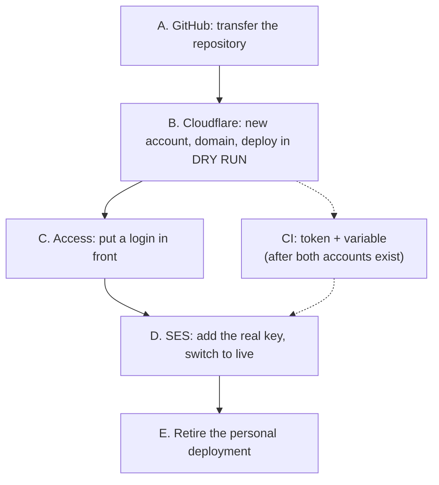

# Handover: moving the studio to the company accounts

Today the studio lives in two personal places: a personal GitHub repository and a personal Cloudflare account. This document is the runbook for moving both to the company, in order, with a check after every step.

Companion documents: `docs/DEPLOYMENT.md` (how deploys work and how to switch live sending on), `docs/PLAN.md` (what gets built next), `docs/DECISIONS.md` (why things are the way they are).

Facts about GitHub and Cloudflare below were verified against the official documentation on 2026-09-10. Where a claim could not be confirmed it says so instead of guessing.

## Do it now — and the cheap window has closed

**Superseded, 2026-09-19.** This section used to say "there is no database, no stored user data and no
custom domain", and that the move was an afternoon. That was true until `docs/PLAN.md` phase 2 landed.
**There is data now**: templates and their immutable versions in a Cloudflare D1 database, and
uploaded images in an R2 bucket, both on the account `wrangler.jsonc` pins (ADR-21, ADR-22). The move
is therefore a data migration with a freeze window — export, create on the new account, apply
migrations, import, copy the R2 objects — exactly as part B below now describes. Doing it is no
longer an afternoon, and every week it waits adds rows. There is still no custom domain, which is
what Cloudflare Access needs (TECH_DEBT #19).

## Which order, and why



GitHub first, because the deploy credentials live on the repository and you only want to create them once. Cloudflare second. **Access before live sending**, because the deployed studio has no authentication of its own: a live Amazon SES key on a public URL is a stranger's send button. Once `SES_ALLOWED_RECIPIENTS` is `*` (ADR-17) there is no allow-list left to bound it: what remains is the password gate, at most 10 recipients per send, the forced `[TEST]` subject, 5 sends a minute and the SES account suppression list.

## Before you start: what you need from other people

| Ask                                                                             | From                | Why                                                            |
| ------------------------------------------------------------------------------- | ------------------- | -------------------------------------------------------------- |
| Permission to create a repository in the company GitHub organisation            | GitHub org owner    | Without it the transfer cannot complete                        |
| The organisation's Actions policy, and whether Actions run on transferred repos | GitHub org owner    | An org policy can disable or restrict workflows after transfer |
| A Cloudflare account, with you as Super Administrator or Workers Admin          | IT / platform owner | Deploying, secrets and Access applications all need it         |
| A hostname you may point at Cloudflare, for example `studio.swarm.camp`         | Whoever owns DNS    | Access and a stable URL both need a real hostname              |
| An AWS IAM user for the studio, scoped as in `docs/DEPLOYMENT.md`               | AWS account owner   | The Worker signs its own SES requests and needs a key pair     |
| Confirmation that SES production access was granted for the sending domain      | Whoever filed it    | In the sandbox you can only send to verified addresses         |

## Decide these first

| Decision           | Options                                           | Suggestion                                                                  |
| ------------------ | ------------------------------------------------- | --------------------------------------------------------------------------- |
| Hostname           | `studio.<company>` vs staying on `*.workers.dev`  | A real hostname. Access needs one and the URL stops changing.               |
| Repository name    | Keep `email-template-studio`                      | Keep it. Renaming during a transfer needs org ownership and breaks links.   |
| Visibility         | Private vs internal                               | Private, or internal if the org has that tier.                              |
| Environments       | One production Worker vs `staging` + `production` | Both, from the start. It costs nothing and gives you somewhere to be wrong. |
| Who else admins it | At least one other person                         | Two, always. A single-owner internal tool is an outage waiting to happen.   |

---

# Part A. GitHub

The repository is `Jericho0912/email-template-studio` on a personal account.

## A1. Transfer, do not re-push

Transferring keeps the git history, issues, pull requests, wiki, stars and watchers, keeps forks in the same network, and leaves a redirect at the old URL. Pushing to a fresh repository throws all of that away. Transfer unless the organisation forbids it.

**What you need:** administrator access to the repository (you have it, you own it) **and** permission to create a repository in the target organisation. The organisation must not already have a repository with the same name.

## A2. The transfer

1. Push everything first. A transfer moves what GitHub has, not what is on your laptop.

   ```bash
   git push origin main
   git status          # must be clean
   ```

2. On GitHub: repository → **Settings** → scroll to **Danger Zone** → **Transfer** → type the organisation name as the new owner → confirm.
3. Update your local remote:

   ```bash
   git remote set-url origin https://github.com/<org>/email-template-studio.git
   git remote -v
   git fetch origin
   ```

   The old URL redirects, so an un-updated clone keeps working. Do not rely on that: the redirect is **permanently destroyed** if anyone later creates a repository at the old owner and name.

## A3. Check what survived

The transfer documentation says webhooks, services, secrets and deploy keys stay associated. It says **nothing** about Actions _variables_, branch protection rules or rulesets. So check rather than assume. Go through each of these in the new repository's settings:

| Where                                      | What to confirm                                                          |
| ------------------------------------------ | ------------------------------------------------------------------------ |
| Settings → Secrets and variables → Actions | `CLOUDFLARE_API_TOKEN` secret and `CLOUDFLARE_ACCOUNT_ID` variable exist |
| Settings → Actions → General               | Actions are allowed at all; the org policy may restrict or disable them  |
| Settings → Rules, and Settings → Branches  | Branch protection on `main` still exists                                 |
| Settings → Collaborators and teams         | The right team has write access; add a second admin                      |

You are going to replace the Cloudflare token in Part C anyway, so a missing secret here is not a problem. A silently disabled Actions policy is: CI would go quiet rather than fail.

## A4. Protect `main`

The deploy job runs on every push to `main`, so `main` is production. Add a ruleset (Settings → Rules → Rulesets → New branch ruleset) targeting `main` with:

- Require a pull request before merging, 1 approval.
- Require status checks to pass: select the **check** job from `.github/workflows/ci.yml`.
- Block force pushes.

## A5. Gotchas worth knowing

- **Org policy can block the transfer.** The organisation setting is Access → Member privileges → "Repository deletion and transfer", and an enterprise policy can override it. If the Danger Zone has no Transfer button, this is why. Ask an owner.
- **The old name may be retired forever.** If the repository had more than 100 clones or more than 100 Actions runs in the week before the transfer, GitHub permanently retires the old owner-and-name combination. Nobody, including you, can reuse it.
- **GitHub Pages is not redirected.** This repository does not use Pages, so nothing to do.

---

# Part B. Cloudflare

Today: Worker `email-template-studio` on the personal account `d0fa6b3d72170539438800a907ec5323` (the id `wrangler.jsonc` pins), at `https://email-template-studio.jerichodelrosario35.workers.dev`.

**There is data now.** Templates live in a Cloudflare D1 database and uploaded images in an R2 bucket, both on that same account (ADR-21). Moving accounts therefore means moving data: export the database, create it on the new account, apply migrations, import, and copy the R2 objects. The exact commands are in "Moving to the production account" in `docs/DEPLOYMENT.md`. Do the move during a short freeze of edits.

## B1. Get into the company account

1. Have an administrator add you with **Super Administrator** or **Workers Admin**. Workers Admin is enough to deploy; you need more to create an Access application, so either take Super Administrator or plan to pair with someone for step B5.
2. Note the **account id** from the dashboard URL or the account home page.
3. Point wrangler at it:

   ```bash
   npx wrangler logout
   npx wrangler login          # sign in with the company account
   npx wrangler whoami         # confirm the account name and id BEFORE anything else
   ```

   `whoami` before every manual deploy, until the config pins the account in B3.

4. The Workers **Free** plan is enough for everything up to `docs/PLAN.md` phase 4. Queues need Workers Paid at 5 US dollars a month. Do not buy it yet.

## B2. Put the hostname on Cloudflare

Cloudflare has to be authoritative for the zone: you cannot attach a custom domain to a zone the account does not own.

1. Add the zone (for example `swarm.camp`) in the dashboard, or ask DNS to delegate a subdomain.
2. Follow the nameserver instructions and wait for the zone to go active.
3. Decide the exact hostnames now: `studio.swarm.camp` for production, `studio-staging.swarm.camp` for staging.

## B3. Point the project at the new account

Two edits to `wrangler.jsonc`.

**Pin the account.** Add at the top level, so a stale login can never deploy to the wrong place:

```jsonc
"account_id": "<company account id>",
```

**Add environments.** One trap here, and it is the one that bites people: `vars` and `routes` are **non-inheritable**. An environment does not inherit the top-level `vars`; anything you do not repeat inside the environment block is simply absent. Restate every variable in every environment.

```jsonc
"env": {
  "staging": {
    "name": "email-template-studio-staging",
    "routes": [{ "pattern": "studio-staging.swarm.camp", "custom_domain": true }],
    "vars": {
      "STUDIO_SEND_ENABLED": "true",
      "STUDIO_SEND_DRY_RUN": "true",
      "AWS_REGION": "us-east-1",
      "SES_FROM_ADDRESS": "studio@swarm.camp",
      "SES_ALLOWED_RECIPIENTS": "you@swarm.camp"
    }
  },
  "production": {
    "name": "email-template-studio",
    "routes": [{ "pattern": "studio.swarm.camp", "custom_domain": true }],
    "vars": {
      "STUDIO_SEND_ENABLED": "false",
      "AWS_REGION": "us-east-1",
      "SES_FROM_ADDRESS": "studio@swarm.camp",
      "SES_ALLOWED_RECIPIENTS": "you@swarm.camp,teammate@swarm.camp"
    }
  }
}
```

Notes on that block:

- `custom_domain: true` with `pattern` is the whole custom-domain syntax. Cloudflare creates the DNS record and issues the certificate itself. No `zone_id` needed.
- Without an explicit `"name"`, deploying an environment produces a Worker called `<top-level name>-<environment>`. Naming production explicitly keeps it as `email-template-studio`.
- Production starts with sending **off**. It gets switched on in B6, after Access.
- Staging starts in **dry run**: the full send path, fake message ids, no AWS credentials anywhere.

Then regenerate the binding types and deploy staging:

```bash
npm run cf:types
npm run build
npx wrangler deploy --env staging
```

Each environment is a separate Worker with its own dashboard entry, its own secrets and its own routes. That is the point.

## B4. Verify the deployment before it can do anything

```bash
U=https://studio-staging.swarm.camp
curl -s -o /dev/null -w "%{http_code}\n" $U/                   # 200
curl -s -o /dev/null -w "%{http_code}\n" $U/some/deep/path     # 200, single-page-app fallback
curl -s $U/api/send-test/status                                # "mode":"dry-run"
curl -s -o /dev/null -w "%{http_code}\n" -X POST \
  -H "origin: https://attacker.example" -H "content-type: application/json" \
  -d '{}' $U/api/send-test                                     # 403, cross-site refused
```

Then open it in a browser: the welcome template renders in the preview frame and the header says the preview worker is ready. Send a test from the dialog and confirm you get a `dry-run-N` message id.

## B5. Access, before any credential exists

The Worker's only current protection is a same-origin check, which stops a cross-site form but not a person with the URL. Access is what makes the studio internal.

1. Zero Trust dashboard → Access → Applications → **Add an application** → Self-hosted.
2. Application domain: `studio.swarm.camp`. Repeat for the staging hostname.
3. Policy: Allow, with the rule **Emails ending in** `@<company domain>`.
4. Note the application's **AUD** tag. The Worker will need it.
5. Sign in from a private browser window and confirm you are challenged.

The Worker does not verify the token yet. That is `docs/PLAN.md` phase 1: middleware that checks the `Cf-Access-Jwt-Assertion` header against the team JWKS at `https://<team-name>.cloudflareaccess.com/cdn-cgi/access/certs`, matching the `aud` claim to the tag from step 4. Until that lands, Access is enforced by the edge in front of the Worker, which is genuine protection for browser traffic but not for anything that could reach the Worker's hostname directly.

Cost: Zero Trust has a free tier that widely published figures put at 50 users. That number is not stated on any Cloudflare documentation page I could check, so confirm it on the plan selection screen during onboarding rather than promising it to anyone.

## B6. Switch production on

Only now, with a login in front of it. Follow "Turning live sending on" in `docs/DEPLOYMENT.md` for the IAM policy, then:

```bash
npx wrangler secret put AWS_ACCESS_KEY_ID --env production
npx wrangler secret put AWS_SECRET_ACCESS_KEY --env production
```

Set `STUDIO_SEND_ENABLED` to `"true"` and `STUDIO_SEND_DRY_RUN` to `"false"` in the production `vars`, deploy, and check the preflight:

```bash
npm run build
npx wrangler deploy --env production
curl -s https://studio.swarm.camp/api/send-test/status
```

Expect `"mode":"live"`, `preflight.ok` true, and `sandbox` false if production access came through. Send one real test to your own address before telling anyone the tool is ready.

Secrets are per environment. Staging never gets a key; it stays in dry run.

## B7. Retire the personal deployment

Only after production has served a real send.

```bash
npx wrangler logout
npx wrangler login            # personal account
npx wrangler whoami           # triple-check: this deletes a Worker
npx wrangler delete --name email-template-studio
npx wrangler logout
npx wrangler login            # back to the company account
```

Then update the table at the top of `docs/DEPLOYMENT.md` and the status line in `README.md` so nobody follows a dead URL.

---

# Part C. CI on the new accounts

`.github/workflows/ci.yml` already has a deploy job that runs on pushes to `main` and skips itself when `CLOUDFLARE_API_TOKEN` is absent. Three things to do.

1. **Create the token** in the company Cloudflare account: My Profile → API Tokens → Create Token → **Edit Cloudflare Workers** template, scoped to that one account. Copy it once.
2. **Put it on the repository:**

   ```bash
   gh secret set CLOUDFLARE_API_TOKEN --repo <org>/email-template-studio
   gh variable set CLOUDFLARE_ACCOUNT_ID --repo <org>/email-template-studio --body "<company account id>"
   ```

3. **Make the deploy job environment-aware.** It currently runs a bare `deploy`, which would target the top-level configuration rather than production. Change the wrangler step's command to `deploy --env production`. Consider adding a staging deploy on every pull request later; that needs a preview hostname and is not worth it yet.

Confirm by pushing a trivial commit to `main` and watching the run. A green **check** job with a skipped deploy means the secret is missing or misnamed.

---

# Part D. Done when all of these are true

- [ ] `git remote -v` points at the organisation, and `git push` works.
- [ ] The repository is private, `main` is protected, and CI is green on it.
- [ ] `npx wrangler whoami` shows the company account, and `wrangler.jsonc` pins `account_id`.
- [ ] `https://studio.swarm.camp` serves the studio over a Cloudflare certificate.
- [ ] A private browser window is challenged by Access before reaching it.
- [ ] `/api/send-test/status` reports `"mode":"live"` with `preflight.ok` true.
- [ ] One real test email arrived, sent from the deployed studio by someone with no local setup.
- [ ] Staging exists, is in dry run, and holds no AWS credentials.
- [ ] The personal Worker is deleted and the personal Cloudflare account holds nothing.
- [ ] `docs/DEPLOYMENT.md` and `README.md` name the new URL and account.
- [ ] A second person can deploy: they have Cloudflare access, repository access, and have done it once.

# Part E. If it goes wrong

| Symptom                           | Do this                                                                                                 |
| --------------------------------- | ------------------------------------------------------------------------------------------------------- |
| Bad deploy                        | `npx wrangler rollback --env production`, or `npx wrangler versions list --env production` and pick one |
| Deployed to the wrong account     | Delete the Worker there, add `account_id` to `wrangler.jsonc`, redeploy                                 |
| Sending misbehaving               | Set `STUDIO_SEND_ENABLED` to `"false"` and deploy. Fastest kill switch; no code change                  |
| A key may have leaked             | Deactivate it in AWS IAM first, then `wrangler secret put` the replacement. In that order               |
| Transfer button missing on GitHub | Org policy blocks member transfers; ask an owner to allow it or to perform the transfer                 |
| CI deploy job skipped             | `CLOUDFLARE_API_TOKEN` is missing or misnamed on the new repository                                     |
| Access locks everyone out         | Delete the Access application in Zero Trust; the hostname serves the Worker directly again              |

# Still needs a human decision

1. **Who owns this after the move.** A second admin on both accounts, named, not implied.
2. **Which AWS account and region** the studio's IAM user lives in, and whether the company uses short-lived credentials. If it does, `AWS_SESSION_TOKEN` expires and a long-lived Worker secret is the wrong shape. Ask before creating a static key.
3. **Whether staging needs its own SES identity** or shares production's in dry run. Dry run needs neither.
4. **Whether `main` deploys straight to production** or whether production should wait for a tag. Straight to production is fine for an internal tool with rollback; say so out loud rather than defaulting into it.
