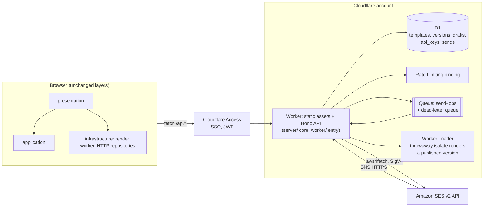

# Build plan: from the MVP to the full application on Cloudflare

Written 2026-09-08, after the MVP (M1) and local test sending (M2, local half). This is the working plan for everything that comes next: what "the whole application" means, how the code moves to Cloudflare, in what order, and which decisions still need a human. Facts about Cloudflare below were verified on 2026-09-08 against the official docs and npm; versions are those published on that date.

Read it top to bottom once, then use section 5 (phases) as the checklist.

## 1. Decisions at a glance

| Topic                | Decision                                                                                                                                       | Why (short)                                                                                                                 |
| -------------------- | ---------------------------------------------------------------------------------------------------------------------------------------------- | --------------------------------------------------------------------------------------------------------------------------- |
| Hosting              | **One Cloudflare Worker** that serves the SPA as static assets and runs the Hono API. Not Cloudflare Pages.                                    | Cloudflare's own guidance for new projects; Pages is maintenance-only. One deploy, one URL, no CORS.                        |
| Build integration    | `@cloudflare/vite-plugin` 1.54 (supports Vite 8) + `wrangler` 4.129, config in `wrangler.jsonc`.                                               | `npm run dev/build/preview` keep working; the Worker runs in the real runtime (workerd) locally.                            |
| Server code          | Keep `server/` as runtime-neutral Hono code. Add a thin Cloudflare entry (`worker/index.ts`); keep the Node entry for people without wrangler. | `createApp()` already takes injected config and sender; nothing in it depends on Node.                                      |
| SES client           | Replace `@aws-sdk/client-sesv2` with **`aws4fetch`** (2.5 KB) calling the SES v2 REST API.                                                     | The AWS SDK relies on Node/DOM APIs that Workers lack; the bundle would also be huge. Same `EmailSender` interface.         |
| Credentials          | IAM user with a policy limited to `ses:SendEmail` from one identity, stored as **Worker secrets**; locally in git-ignored `.dev.vars`.         | Workers cannot read `~/.aws`. The IAM policy (not just our code) restricts sender and recipients.                           |
| Alternative provider | Cloudflare Email Service (beta, Workers Paid) as a second `EmailSender` behind the same interface. Not the default yet.                        | No secrets at all, but beta and needs a domain on Cloudflare. Keep the option open; do not depend on it.                    |
| Authentication       | **Cloudflare Access** in front of the whole app; the Worker verifies the Access JWT on `/api/*`.                                               | Internal tool, teammates only. Free for up to 50 users. No login UI to build.                                               |
| Persistence          | **D1** (SQLite) with wrangler migrations, plain SQL + Zod on rows. No ORM to start.                                                            | Smallest dependency set; SQL is a transferable skill. Drizzle is the upgrade path if queries multiply.                      |
| Rate limiting        | Workers **Rate Limiting binding** (GA since 2025-09), keyed by user email.                                                                     | Replaces the in-memory limiter, which resets on every isolate restart.                                                      |
| Async sends          | **Queues** with a dead-letter queue, from phase 4 on.                                                                                          | Retries and back-pressure without blocking the request. Needs Workers Paid.                                                 |
| Server-side render   | **Worker Loaders** (Dynamic Workers, closed beta) run a published template in a throwaway isolate.                                             | Workers forbid `eval`/`new Function`, so today's `evaluateTemplate` cannot run in the API Worker. Sign up for the beta now. |
| Props schemas        | Store **JSON Schema** per version (`z.toJSONSchema`), validate in the browser and the Worker.                                                  | Zod code cannot live in a database row. JSON Schema is portable.                                                            |
| Environments         | `local` (workerd via Vite), `staging`, `production` as wrangler environments with separate D1, secrets and Access policies.                    | Same code, different bindings. The environment badge in the header stops being decorative.                                  |

## 2. What "the whole application" is

Scope comes from `docs/design-brief.md` and the milestones in `docs/ROADMAP.md`. In one sentence: an internal transactional-email platform where teammates author React Email templates, publish immutable versions, and other systems send those templates with props through an authenticated API, with delivery visible in the tool.

Screens and capabilities, in the order they will be built:

1. **Studio** (exists): edit TSX and props, isolated preview, diagnostics, test send.
2. **Sign-in and identity**: Cloudflare Access; the header shows who is signed in.
3. **Template library as data** (done, differently — see the phase 2 note below): create, rename, delete; templates and their versions live in D1. DRAFTS did not move: they stay in `sessionStorage` (ADR-10), because a draft is a fact about one browser.
4. **Versions and publishing**: publish creates an immutable version; version list, diff, rollback; environment targets `sandbox` and `production`; hold-to-confirm and type-to-confirm as the brief specifies.
5. **Sending API**: `POST /api/v1/emails` with `{ template, version?, props, to }`, API keys, idempotency keys, queue-backed delivery.
6. **Delivery log**: every send with status (`queued`, `sent`, `bounced`, `complained`, `failed`), message id, timestamps; SES feedback arrives through an SNS webhook.
7. **Operations**: staging and production, CI deploys, logs, D1 backups, cost visibility.

Still out of scope (unchanged from the roadmap): marketing campaigns, contacts, customer-managed domains, attachments, collaborative editing, AI content. **Drag-and-drop email building is no longer on that list** — ADR-18 superseded it and the studio has a visual canvas (see `docs/ROADMAP.md`).

## 3. Target architecture



Runtime facts that shaped this (verified 2026-09-08):

- Workers **cannot** run `eval` or `new Function`. The preview keeps compiling and rendering in the browser exactly as today. Server-side rendering of arbitrary templates needs a Worker Loader (an isolate created at request time, no bindings, hard boundary). Its API works in local wrangler today; running it on Cloudflare needs a closed-beta sign-up.
- Worker bundle limit: 3 MB compressed on Free, 10 MB on Paid. Hono + Zod + aws4fetch is well under 1 MB. `@react-email/components` must never be bundled into the API Worker; it stays in the browser worker and, later, in the loaded isolate.
- Static asset requests are not billed. `run_worker_first: ["/api/*"]` sends only API paths to the Worker; everything else is served from assets with `not_found_handling: "single-page-application"`.
- Queues and Cloudflare Email Service need the Workers Paid plan (USD 5/month). Access, D1, Rate Limiting and Worker Loaders local dev work on Free. Budget for Paid from phase 4.
- Cloudflare Access needs a hostname in the account. Plan on a custom domain for the Worker (for example `studio.<company-domain>`) rather than `*.workers.dev`.

## 4. Code layout after the move

The four layers in `src/` stay exactly as they are. What changes is where the outside world lives.

```
src/                 unchanged layers; infrastructure gains HTTP repositories
shared/              NEW: Zod schemas for every API request/response, imported by browser AND Worker
server/              runtime-neutral Hono app (createApp, emailSender interface, auth middleware)
  app.ts             routes; today's file, split per resource as it grows
  emailSender.ts     interface + dry-run; SES implementation moves to sesSender.ts (aws4fetch)
  auth.ts            NEW: Access JWT verification (JWKS from the team domain)
  repositories/      NEW: TemplateRepository, VersionRepository, SendRepository over D1
  node.ts            today's index.ts: Node adapter, still works for laptops without wrangler
worker/
  index.ts           NEW: Cloudflare entry: builds config from env bindings, exports fetch + queue handlers
  env.d.ts           NEW: typed bindings (generated by `wrangler types`)
migrations/          NEW: numbered .sql files applied with `wrangler d1 migrations apply`
wrangler.jsonc       NEW: name, main, assets, bindings, environments
.dev.vars            NEW, git-ignored: local secrets (AWS keys for the dry-run/live sender)
```

Rules that keep it understandable:

- `server/` never imports from `node:*` or from `cloudflare:*`. Adapters (`server/node.ts`, `worker/index.ts`) do the platform work and hand plain objects in.
- Every route validates its body with a schema from `shared/` and the browser parses every response with the same schema. One source of truth for the API contract; the duplication that exists today between `server/app.ts` and `emailProvider.ts` goes away.
- The browser talks to repositories through interfaces declared in `application/` (`TemplateRepository`), the same way `EmailProvider` works now. (Done: `HttpTemplateRepository` and `InMemoryTemplateRepository` both implement it, picked by `VITE_DATA_MODE`; `registry.ts` became `STARTER_TEMPLATES`, the seed input for migration 0002 and for test fixtures, rather than a repository of its own — ADR-20, ADR-23.)

## 5. Phases

Each phase ends with something deployed and used. Sizes are relative (S = a day or two, M = about a week, L = two to three weeks) for one developer learning the platform as they go. Do them in order; each one is a merge to `main` and a deploy.

### Phase 0. Deploy the MVP as it is (S)

Goal: the studio runs at a Cloudflare URL with sending disabled; the local workflow keeps working.

1. `npm i -D wrangler @cloudflare/vite-plugin @cloudflare/workers-types`. Add `cloudflare()` to `vite.config.ts` and remove the `/api` proxy (the plugin routes `/api/*` to the Worker in dev).
2. Create `wrangler.jsonc` with `main: "./worker/index.ts"`, `compatibility_date` set to today, `compatibility_flags: ["nodejs_compat"]`, and the `assets` block above.
3. Create `worker/index.ts`: read the same variables `loadConfig` expects from `env`, call `createApp`, export `{ fetch: app.fetch }`. Rename `server/index.ts` to `server/node.ts` and point the `server` scripts at it.
4. Add `tsconfig.worker.json`, add it to the root `references`, run `wrangler types` to generate `worker/env.d.ts`.
5. `npm run build` then `npx wrangler deploy` by hand once; confirm the Vite preview (now workerd) passes the Playwright suite.
6. Add a GitHub remote (there is none today), a GitHub Actions workflow that runs `npm run check`, `npm run build`, `npm run test:e2e`, and deploys `main` with a `CLOUDFLARE_API_TOKEN` secret scoped to Workers Scripts:Edit.

Exit criteria: URL live, sending shows "disabled" with a reason, CI green on `main`, `docs/SENDING.md` updated for the two ways to run locally.

Learning items: what a Worker is (an isolate, not a container), bindings, `wrangler.jsonc`, the difference between build-time (`vite build`) and deploy-time (`wrangler deploy`).

### Phase 1. Identity and sending on Cloudflare (M)

Goal: teammates sign in through Access and can send allow-listed test emails from the deployed app.

> **Progress, 2026-09-10.** Step 4 is **done** (ADR-16): `server/sesSender.ts` now runs on `aws4fetch` in both runtimes, `@aws-sdk/client-sesv2` is gone, and the Worker can send. Step 5 is documented but not performed: the IAM policy to copy is in `docs/DEPLOYMENT.md` under "Turning live sending on". Steps 1, 2, 3, 6 and 7 are open, and steps 1 to 3 are the reason live sending stays switched off on the deployed Worker: it has no authentication yet. The account move that steps 1 and 5 depend on is `docs/HANDOVER.md`.
>
> **Progress, 2026-09-11.** Steps **2 and 3 are done in code**: `server/auth.ts` verifies the
> Access JWT (RS256 only, issuer and audience pinned, expiry checked, signing keys cached for
> an hour), and `createApp` now refuses any `/api/*` request it cannot attribute to a person —
> including when no authenticator is wired in at all, so a forgetful adapter fails closed.
> Local runs and the Playwright suite use a fixed `STUDIO_DEV_IDENTITY` instead of a tunnel.
> Step 1 is **not** done and is the remaining blocker: Access needs a hostname in a zone, and
> the current target is the personal account, which must not get a custom domain (`docs/HANDOVER.md`).
> The dashboard walkthrough is in `docs/DEPLOYMENT.md` under "Putting Cloudflare Access in front".

1. Put the Worker on a custom domain; create an Access application for it with an allow policy for the team's email domain.
2. `server/auth.ts`: middleware that verifies `Cf-Access-Jwt-Assertion` against the team's JWKS (WebCrypto `subtle.verify`, cache keys for an hour) and puts `{ email }` on the Hono context. In `local`, accept a fixed developer identity from `.dev.vars` so no tunnel is needed.
3. Replace the Host/Origin loopback check with: authenticated user required for every `/api/*` route. Keep the custom header and JSON content-type checks; they still stop cross-site forms.
4. `server/sesSender.ts` on `aws4fetch`: `POST /v2/email/outbound-emails`, `GET /v2/email/account`, `GET /v2/email/identities/{id}`. Same `EmailSender` interface, same tests with a fake `fetch`. Delete the AWS SDK dependency.
5. IAM: a user (or role via a broker if the company has one) whose only policy allows `ses:SendEmail` with conditions `ses:FromAddress` equals the studio identity and `ses:Recipients` within the allow-list, plus read-only `ses:GetAccount` and `ses:GetEmailIdentity`. Store the keys with `wrangler secret put`.
6. Rate limiting: add a `ratelimits` binding (for example 5 per 60 s) keyed by the user's email; drop `createRateLimiter` from the request path but keep it in `server/node.ts` for the Node adapter.
7. Show the signed-in email and the environment badge in `GlobalHeader`.

Exit criteria: a teammate with no local setup sends a `[TEST]` email from the deployed studio; a signed-out request to `/api/send-test` gets 401; secrets exist only in Cloudflare and `.dev.vars`.

Learning items: JWT verification with WebCrypto, IAM condition keys, SigV4 (you do not implement it, but know what `aws4fetch` signs), wrangler secrets vs vars.

### Phase 2. Templates and drafts as data (L)

Goal: templates, drafts and metadata live in D1; the UI can create a template; `registry.ts` becomes seed data.

> **Progress, 2026-09-19. This phase is delivered**, by phases 7a and 7b of the visual-editor plan,
> with four deliberate differences from the sketch below.
>
> 1. **Drafts did not move to the server.** They stay in `sessionStorage`, per template, with the
>    server `revision` they were started from. A draft is one person's unfinished work in one
>    browser; syncing it would have meant a write per keystroke and a second concurrency problem on
>    top of the one that matters. So there is no `drafts` table.
> 2. **The column names differ** from the sketch: `source` (not `tsx_source`), `props_sample` (not
>    `default_props`), `version_number` (not `number`/`version`), `plain_text`, plus `document`,
>    `theme` and `html` for the visual kind. `compiled_js` is not stored at all — the studio compiles
>    in the browser and stores the rendered HTML instead. `docs/FEATURE_PLAN.md` §10 was corrected to
>    match.
> 3. **Concurrency is a `revision` counter, not a timestamp** (ADR-22), and every write is one
>    `db.batch`, so a stale save writes nothing and gets a 409 carrying the server's copy.
> 4. **Repository tests do not use `@cloudflare/vitest-pool-workers`**: it peer-requires Vitest 4 and
>    this repo is on 5. The contract suite runs against the in-memory store and against Node's
>    built-in SQLite driving the real migration file; local D1 itself is covered by
>    `e2e/templates.spec.ts` (TECH_DEBT #24).
>
> Also delivered here rather than in phase 3: the create-template dialog, the delete dialog, the
> version-conflict dialog and `Mark as ready / Mark as draft`.

Schema (first migration):

```sql
templates          id, slug UNIQUE, name, description, category, status, from_name, from_address,
                   subject, created_by, created_at, updated_at, archived_at
template_versions  id, template_id, number, source, compiled_js, props_schema_json, sample_props_json,
                   published_by, published_at, notes           -- immutable rows, (template_id, number) UNIQUE
drafts             template_id, user_email, source, sample_props_json, updated_at   -- PRIMARY KEY (template_id, user_email)
```

1. `application/TemplateRepository` interface: `list()`, `get(id)`, `create()`, `saveDraft()`, `discardDraft()`. Keep `EmailTemplate` as the browser-side shape; add a `toEmailTemplate()` mapper that turns a version row plus JSON Schema into today's object (with `validateProps` built from the schema).
2. Props validation from data: generate the JSON Schema for the three sample templates with `z.toJSONSchema` in the seed migration. In the browser, build the validator with `z.fromJSONSchema` (Zod 4.2; marked experimental) behind the existing `PropsValidator` adapter so it can be swapped for a JSON Schema validator without touching the UI. Record this in TECH_DEBT.
3. Worker routes: `GET /api/templates`, `GET /api/templates/:id`, `POST /api/templates`, `PUT /api/templates/:id/draft`, `DELETE .../draft`. Schemas in `shared/`.
4. Browser: `HttpTemplateRepository`; `useStudio` loads from it instead of the registry; the draft-per-template reducer logic stays, but drafts now save to the server (debounced) instead of `sessionStorage`. Keep `sessionStorage` as the offline buffer.
5. "Create template" dialog with the brief's microcopy; slug immutable after first publish.
6. Tests: repository tests run with `@cloudflare/vitest-pool-workers` against a local D1; existing unit tests unchanged.

Exit criteria: a template created in the UI survives a redeploy; two users have independent drafts; `registry.ts` is only used by seeds and tests.

Learning items: SQL DDL and migrations (compare with metadata deploys), repository pattern, optimistic UI for draft saves, D1 Time Travel for restores.

### Phase 3. Versions, publishing, environments (M)

Goal: "Publish" is real. A version is immutable, has a number, can be diffed and rolled back, and is targeted at `sandbox` or `production`.

1. Publish flow: the browser compiles the draft with the existing sucrase pipeline, renders the sample once to prove it works, then `POST /api/templates/:id/versions` with `{ source, compiled_js, props_schema_json, sample_props_json, notes }`. The Worker stores it; it does not execute it.
2. Add `template_environments (template_id, environment, version_id, set_by, set_at)`; "Promote to production" is a separate action with hold-to-confirm. Rollback sets an older version.
3. Version list panel (VERSIONS label from the brief): the **read-only** half of this shipped in phase 9 — `Version history` in the studio's overflow menu lists every saved version, newest first, with its number, kind, author, time and note. What is still phase 3 work is the side-by-side source diff (CodeMirror merge view), restoring a version, and a real "Publish version" action. (There is no longer a simulated publish dialog to replace: it was deleted in phase 2 of the visual-editor plan.)
4. Approval step (roadmap M4): a `production` promotion requires a different user than the publisher. Simple rule, one column (`approved_by`), no workflow engine.
5. Diagnostics gain a real check: "sample props validate against the version schema".

Exit criteria: publishing from the UI creates a row, the environment badge reflects the real target, rollback works, an author cannot approve their own production promotion.

### Phase 4. Sending API, queue, delivery log (L)

Goal: another system can send a published template with props; delivery is visible.

Prerequisites: Workers Paid; Worker Loaders beta access approved (apply at the start of phase 0; if it is not approved by the time this phase starts, see the fallback below).

1. API keys: `api_keys (id, name, key_hash, environment, created_by, created_at, revoked_at)`. Keys are shown once, stored as SHA-256. Management UI under settings; keys also usable as Access service tokens if the company prefers.
2. `POST /api/v1/emails`: validate `{ template, version?, props, to, idempotencyKey? }` against `shared/` schemas and against the version's JSON Schema; insert a `sends` row with status `queued`; enqueue `{ sendId }`; return `202 { id }`.
3. Queue consumer (same Worker, `queue()` export): load the send and version, render through the Worker Loader (a module with the stored `compiled_js`, the same three-module `require` shim, no bindings, 5 s CPU limit), call SES, update status. `max_retries: 3`, dead-letter queue `send-jobs-dlq`, alert on DLQ depth.
4. Feedback: SNS topic on the SES configuration set for bounces and complaints, HTTPS subscription to `POST /api/webhooks/ses` (verify the SNS signature with WebCrypto), update `sends.status`.
5. Delivery log screen: filter by template, status, recipient; each row links to the version used and shows the message id in a mono chip.
6. Sandbox environment keeps the recipient allow-list and `[TEST]` prefix; production removes both but requires an approved version.

Fallback if Worker Loaders is not available: the API accepts only pre-rendered HTML from trusted callers (`{ html, subject, to }`), and template rendering stays in the studio. Document it as a limitation rather than running user code in the API Worker some other way.

Exit criteria: a curl with an API key results in an email and a `sent` row; a bounced address shows as `bounced`; a failing render lands in the DLQ with a readable error.

Learning items: at-least-once delivery and idempotency, webhooks and signature verification, why the render isolate gets no bindings.

### Phase 5. Operations (S, continuous)

- `staging` and `production` wrangler environments with their own D1, queues, secrets and Access policies; CI deploys `main` to staging, a manual approval promotes to production.
- Observability: Workers Logs on, structured JSON log lines with `sendId`/`templateId`, a Logpush job if retention beyond 3 days is needed.
- Gradual deployments for the Worker; D1 Time Travel documented as the restore procedure; a weekly `wrangler d1 export` to R2 if the company wants copies it controls.
- Cost sheet in `docs/OPERATIONS.md`: Workers Paid USD 5, D1 and Queues within included usage at internal-tool volumes, SES per-email pricing, Access free tier.
- Dependency updates monthly (`npm outdated`), `compatibility_date` bumped deliberately with a note in DECISIONS.

## 6. Cross-cutting concerns

**Guarantees, restated for the deployed product.** The browser still never holds provider credentials. Sandbox sends still require an allow-listed recipient and a `[TEST]` subject. Production sends exist only from phase 4, only from approved versions, only through API keys. "Publish" stops being a simulation in phase 3, and the README must say so when that ships.

**Testing.** Unit tests in `src/` and `server/` stay on Vitest in Node. Worker-specific code (bindings, D1 repositories, queue handler) uses `@cloudflare/vitest-pool-workers` 0.22 so tests run inside workerd with a local D1. Playwright keeps targeting `vite preview`, which now runs the Worker, so end-to-end tests cover the real API. Every phase adds E2E coverage for its exit criteria.

**Local development.** `npm run dev` runs the SPA and the Worker together in workerd with a local D1 and whatever send posture the top-level `vars` in `wrangler.jsonc` give it — **today that is sending enabled and dry run off**, so with AWS credentials in `.dev.vars` a local dev server is a live sender. `STUDIO_SEND_DRY_RUN=true` in `.dev.vars` is the setting for day-to-day work (`README.md`, `docs/PRIORITIES.md` §3.3). `.dev.vars` also holds `STUDIO_SEND_ENABLED`, the AWS keys and `STUDIO_DEV_IDENTITY` for the auth bypass. The Node send server remains for people who only want the MVP behaviour; it is not on the deploy path. _Corrected 2026-09-19: this paragraph used to say "a dry-run sender by default"._

**Secrets inventory.** `AWS_ACCESS_KEY_ID`, `AWS_SECRET_ACCESS_KEY` (SES-only IAM user), `ACCESS_AUD` and `ACCESS_TEAM_DOMAIN` (public, as vars), `SNS_TOPIC_ARN` (var). Rotation: create the new IAM key, `wrangler secret put`, delete the old key. Nothing else.

**Migrating existing data.** _Superseded 2026-09-19: **there is data now.**_ Templates and their immutable versions live in Cloudflare D1 and uploaded images live in an R2 bucket (ADR-21, ADR-22). The four starters are still seed rows, written by migrations `0002` and `0003` and editable like any other template. Moving that data to another Cloudflare account is a real procedure, not a no-op: `docs/DEPLOYMENT.md`, "Moving to the production account". Session drafts in `sessionStorage` survived phase 2 and are still there — they are the unsaved draft on top of the saved version, not the storage.

## 7. Decisions to record

These become ADR rows 15 to 22 in `docs/DECISIONS.md` as each phase lands: hosting on Workers static assets; Vite plugin; aws4fetch over the AWS SDK; Cloudflare Access; D1 with plain SQL; Rate Limiting binding; JSON Schema as the stored props contract; Worker Loaders for server-side render with the pre-rendered-HTML fallback.

## 8. Risks and open questions

| Risk / question                                                                         | Impact                                      | Plan                                                                                                         |
| --------------------------------------------------------------------------------------- | ------------------------------------------- | ------------------------------------------------------------------------------------------------------------ |
| Worker Loaders beta access is not granted or is slow                                    | Phase 4 cannot render templates server-side | Apply now; build phases 0 to 3 regardless; ship the pre-rendered-HTML fallback if needed.                    |
| `z.fromJSONSchema` is experimental                                                      | Validation could break on a Zod upgrade     | Isolated behind `PropsValidator`; pin Zod; swap to a JSON Schema validator if it regresses.                  |
| Long-lived AWS keys in Worker secrets                                                   | Key leak sends email                        | IAM conditions on sender and recipients; rotation runbook; consider Cloudflare Email Service to remove keys. |
| Cloudflare Email Service leaves beta and becomes the better choice                      | Rework                                      | `EmailSender` interface keeps the swap to one file.                                                          |
| No git remote or CI exists today                                                        | No deploy pipeline, no review               | First task of phase 0.                                                                                       |
| A domain on Cloudflare is needed for Access                                             | Blocks phase 1                              | Ask whoever owns DNS; a subdomain delegated to Cloudflare is enough.                                         |
| Who approves production promotions? Who owns the AWS account and SES production access? | Blocks phases 3 and 4                       | Decide before phase 3; write the answer in `docs/OPERATIONS.md`.                                             |
| Company single sign-on provider for Access (Google, Microsoft, one-time PIN)            | Phase 1 setup detail                        | Ask; one-time PIN works for a pilot.                                                                         |

## 9. Learning map for this plan

| Concept                             | Closest Salesforce idea                        | Where you will meet it              |
| ----------------------------------- | ---------------------------------------------- | ----------------------------------- |
| Worker (V8 isolate, request-scoped) | Apex transaction: short-lived, limits enforced | `worker/index.ts`                   |
| Bindings and `wrangler.jsonc`       | Named Credentials + Custom Metadata for wiring | `wrangler.jsonc`, `worker/env.d.ts` |
| Secrets vs vars                     | Protected Custom Settings vs Custom Metadata   | `wrangler secret put`, `.dev.vars`  |
| D1 migrations                       | Metadata deploys of objects and fields         | `migrations/*.sql`                  |
| Repository interface                | Selector layer (fflib) over SOQL               | `application/TemplateRepository`    |
| Queues + dead-letter queue          | Platform Events / Queueable with retries       | `worker/index.ts` `queue()` handler |
| Access JWT                          | SSO + Profiles/Permission Sets                 | `server/auth.ts`                    |
| Immutable versions                  | Flow versions: activate, never edit            | `template_versions`                 |
| Idempotency key                     | External Id upsert                             | `POST /api/v1/emails`               |
| Webhook signature verification      | Connected app inbound integration validation   | `/api/webhooks/ses`                 |

## 10. First week

1. Create a GitHub repository, push `main`, protect it, add the Actions workflow (phase 0, step 6).
2. Cloudflare account: confirm plan, request Worker Loaders beta access, find out which domain can host `studio.<domain>`.
3. AWS: confirm SES production access status and who owns the account; create the SES-only IAM user.
4. Do phase 0 steps 1 to 5 on a branch; deploy once by hand; open the PR.
5. Update `docs/SENDING.md`, `docs/DECISIONS.md` (ADR 15, 16) and `docs/ROADMAP.md` as part of that PR.
